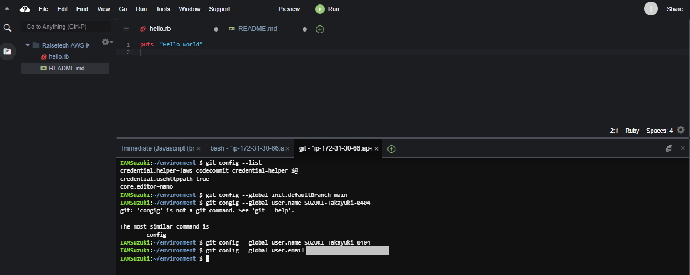

# AWSフルコース講座 課題第2回

## 実施事項

 - GitHubでリポジトリ作成 
     
 - ブランチ保護設定（マージにプルリク承認必須） 
      
 - AWS Cloud9のGit設定見直し  
     
 - GitHubからクローン 
     

## 感想
JAvaフルコースでもGitHubを使ってきた[参考](https://github.com/SUZUKI-Takayuki-0404/Kadai10th)が、ブランク明けなので改めて意識付けする

 - チーム開発におけるバージョン管理：GitHub-flowは、Git-flow全体のうちdevelopブランチとそこからのブランチの運用部分と概ね同じなので、これで頭の中で整理がつきそう
 - ブランチで作業するときは目的を明確にし、目的の異なる作業をごちゃ混ぜにしない
 - 上記の他、勤務先固有の作法は様々なので、事前確認も必要  

