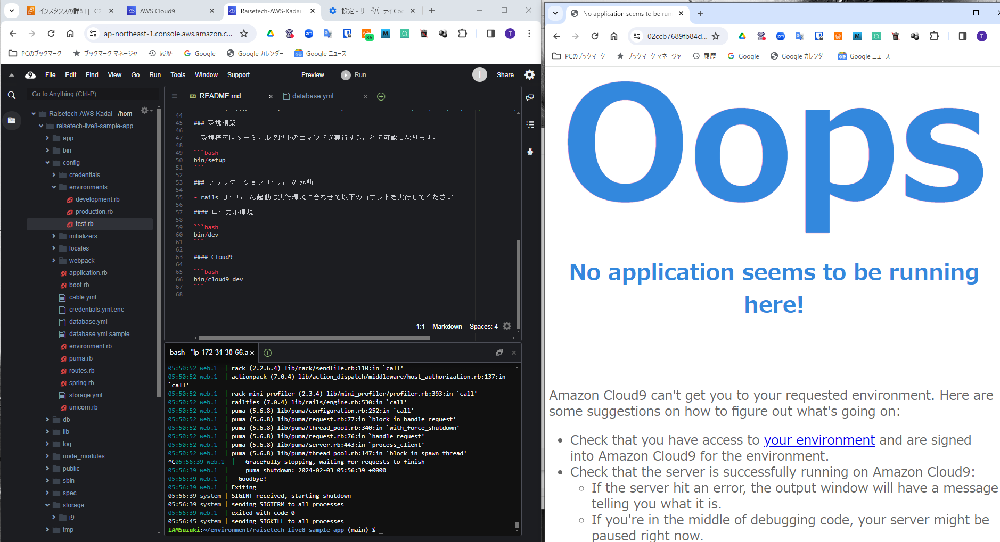

# AWSフルコース講座 課題第3回

## 実施事項

### サンプルアプリケーションのデプロイ

 - インストールと初期設定  
   - Ruby/Bundler/Rails/ストレージ容量確保/MySQL
 - アプリの起動  
   - ブラウザ起動画面  
       
     - soket情報(参照先)の追加  
         
     - (エラー対応)Block解除⇒エラーメッセージ内のhost情報を環境設定に追加 (`config/environment/development.rb`)  
         
         
     - (エラー対応)VFS(Virtual File System)接続無しのエラーメッセージ⇒EC2再起動で解消  
         

### APサーバー/DBエンジンの動作確認

 - 確認項目と結果  
   |項目|確認結果 APサーバー|確認結果 DBエンジン|確認結果 Rails構成管理ツール
   |--|--|--|--|
   |名称とバージョン|puma version 5.6.8(図6-1参照)|MySQL version 8.0.36(図6-1参照)|Bundler version 2.3.14(図6-2参照)|
   |終了時 サンプルアプリへのアクセス可否|不可(図7-1参照)|可(図8-1参照)| \- |
   |再起動時 サンプルアプリへのアクセス可否|不可(図7-2参照)|可(図8-2参照)| \- |

 - 確認結果の付図  
   - 図6：バージョン確認結果(上:図6-1 / 下:図6-2)  
       
       
   - 図7：APサーバーの動作確認結果(上:図7-1 / 下:図7-2)  
       
       
   - 図8：DBエンジンの動作確認結果(上:図8-1 / 下:図8-2)  
       
       

## 所感・気づき事項
- サンプルアプリのデプロイ講座動画どおりに進めたが、それでも予期しないエラー（`Can't connect to local MySQL server through socket '/tmp/mysql.sock' (2)`）に直面し解消に時間を要した。
原因はymlファイルの上書き保存忘れというお粗末なもの。Cloud9上ではファイルを編集しても上書き保存は自動ではない点はMicrosoftのオンラインアプリ等とセンスが異なる点に注意。
- 都度エラーメッセージを調べて原因を解消していく作業は上記以外でも同様で、要領よく処置していくための手段や経験値を増やしていきたい。

