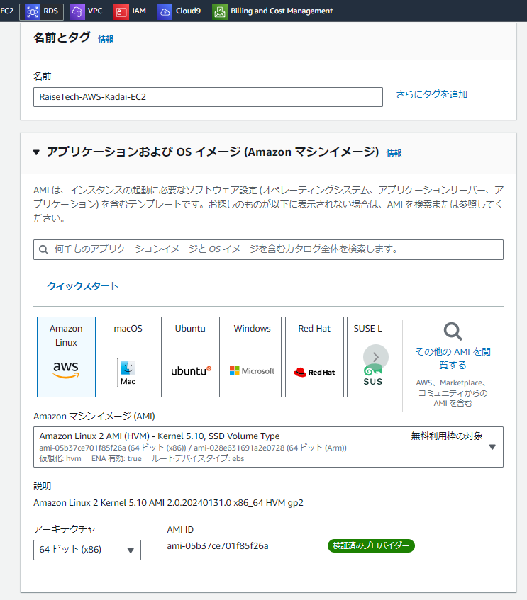
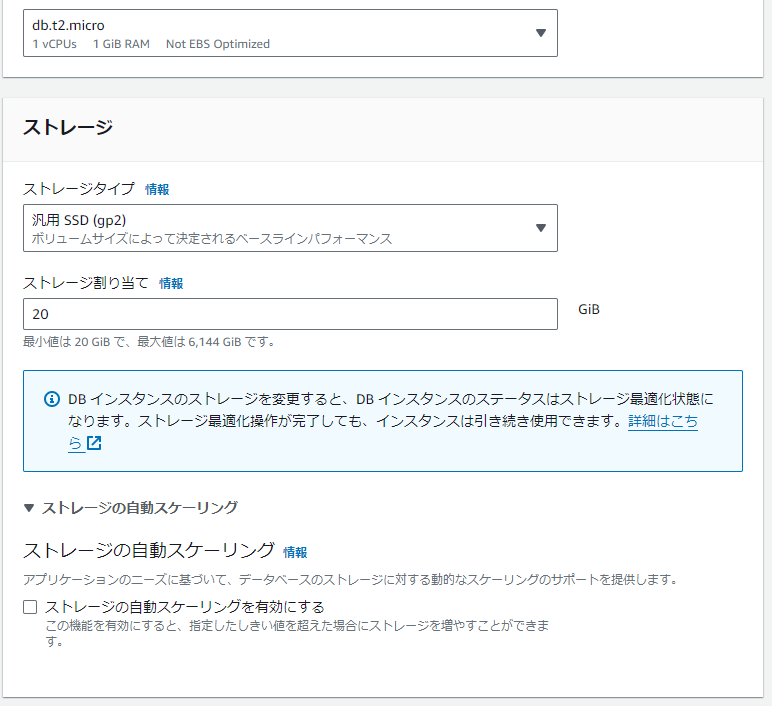

# AWSフルコース講座 課題第3回

## 実施内容

### AWS上にVPC・セキュリティグループ・EC2・RDSの作成と接続確認

- VPCの作成
  - 設定内容
    

- セキュリティグループの作成
  - 設定内容
    
    
    
    

- EC2の作成
  - 設定内容
    
    

- RDSの作成とEC2からの接続確認
  - 設定内容
    

  - 接続確認
    

## 所感

- 全体像を先に考える
- 手戻り事例
    
    

## 備忘録

作業工程スクリーンショット

- EC2作成
  
  
  

- Ubuntu
  - unzip
    
    
    
    
  - AWS CLI
    
    
    
    
- EC2接続
  
  

- MySQLインストール
  

 - RDS作成
  
  
  
  

