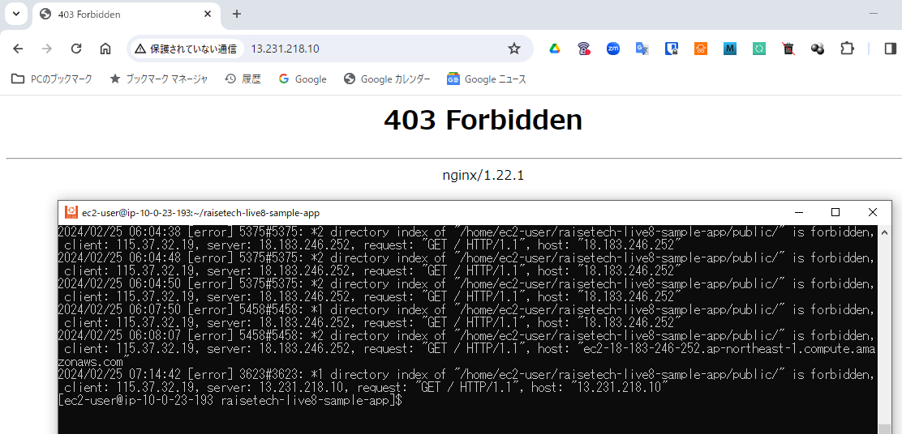
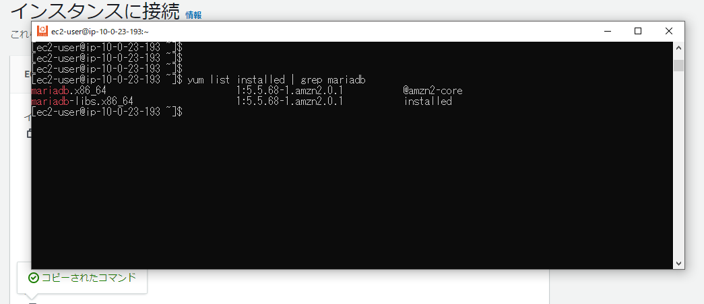
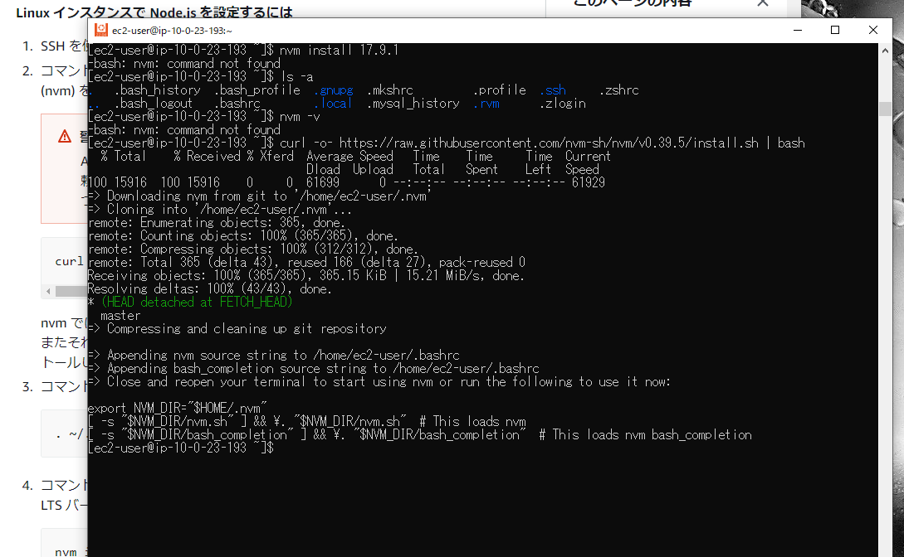
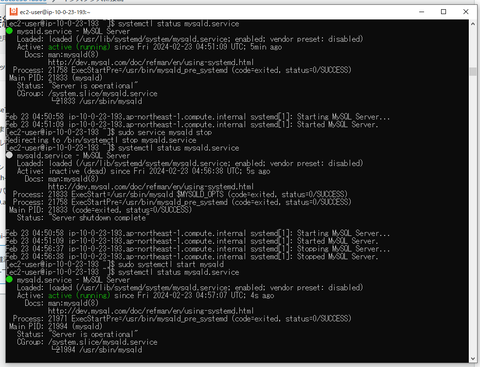
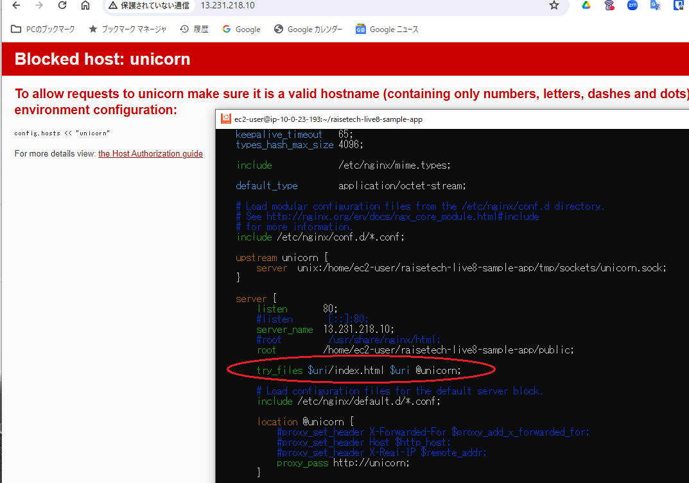
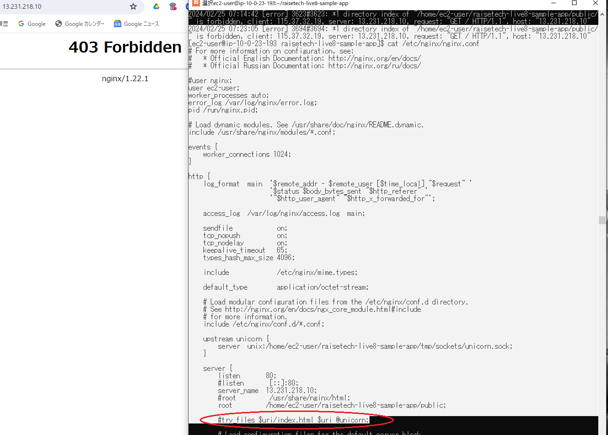
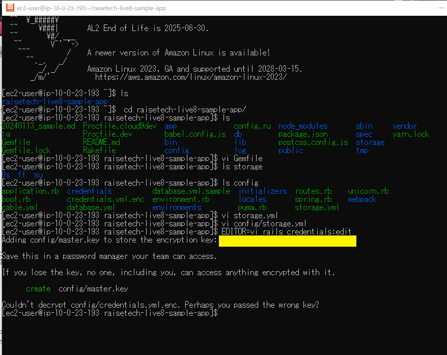

# 第5回課題

## 実施内容

### [サンプルアプリケーション](https://github.com/yuta-ushijima/raisetech-live8-sample-app)のデプロイ結果

- 組み込みサーバーのみ  
    

  - RDSへのデータ登録できていることも確認  
      


- サーバーアプリケーションを分離  
    

  - curlコマンドでunix domain socket経由アクセス接続確認  
      


- ELB(ALB)追加  
    


- S3追加  
    
    

### 構成図

- [Draw.io](https://app.diagrams.net/)で作成  
    


## 所感

- ALBとS3については、マネジメントコンソール内で説明書きを読みながら割とあっさり設定完了できた  
- 今回の課題は各種ソフトウェアのインストール・Ruby on Rails・Unicorn・Nginxの導入をAWSよりも学ぶウエイトが大きかった。 事前に設定方法や手順を整理して臨んだが、これができていなかったらもっと時間がかかったはず。  
- 今回一番の手戻り  
    - NginxとUnicornを両方起動して通信させる際、403エラーの解決に3日要した。原因はNginxの設定ファイル内のtry_filesの記載漏れが原因だが、エラー番号から連想できない箇所で、NginxとUnicornのユーザー不整合やアクセス権限の問題を探してしまった。  
        


## 備忘録

<details>
<summary>作業工程</summary>

1. EC2にSSHで接続  
     

2. yumの最新化  
     

    ```
    sudo yum update
    ```

3. MariaDBのアンインストール
- MariaDBがインストールされていることを確認  
    

  ```
  yum list installed | grep mariadb
  ```

- MariaDBの削除\(-yオプションで確認省略\)  
    

  ```
  sudo yum remove -y mariadb-*
  ```

4. インストール
- git  
    

  ```
  sudo yum install git  
  ```

- ruby 3.1.2  
    - GPG取得\(GNU Privacy Guard：公開鍵\)・RVMインストール  
        
      
      ```
      gpg2 --keyserver keyserver.ubuntu.com --recv-keys 409B6B1796C275462A1703113804BB82D39DC0E3 7D2BAF1CF37B13E2069D6956105BD0E739499BDB
      curl -sSL https://get.rvm.io | bash -s stable
      ```
 
    - Rubyのインストール・設定反映・デフォルト設定  
        
        

      ```
      source /home/ec2-user/.rvm/scripts/rvm
      rvm use --default 3.1.2
      source ~/.bash_profile
      ruby -v
      ```

- Bundler 2.3.14  
    

  ```
  gem install bundler -v 2.3.14
  bundler -v
  ```

- Rails 7.0.4  
    

  ```
  gem install rails -v 7.0.4
  rails -v
  ```

- Node v17.9.1  
    
    

  ```
  curl -o- https://raw.githubusercontent.com/nvm-sh/nvm/v0.39.5/install.sh | bash
  . ~/.nvm/nvm.sh
  nvm -v
  nvm install 17.9.1
  nvm use 17.9.1
  node -v
  ```

- yarn 1.22.19  
    

  ```
  npm install -g yarn@1.22.19
  yarn -v
  ```

- MySQL  
    - インストール\(参考：[リンク](https://github.com/MasatoshiMizumoto/raisetech_documents/blob/main/aws/docs/install_mysql_on_cloud9_amazon_linux_2.md)\)  
        
        

      ```
      curl -fsSL https://raw.githubusercontent.com/MasatoshiMizumoto/raisetech_documents/main/aws/scripts/mysql_amazon_linux_2.sh | sh
      yum list installed | grep mysql
      ```

    - MySQLの起動・停止・状態確認  
        

      ```
      sudo systemctl start mysqld
      ```

      ```
      sudo service mysqld stop
      ```

      ```
      systemctl status mysqld.service
      ```

5. サンプルアプリケーションのクローン  
     

    ```
    git clone https://github.com/yuta-ushijima/raisetech-live8-sample-app.git
    ```

6. サンプルアプリケーションの環境設定と起動

- database.ymlの作成\(サンプルファイルからコピー\)  
    

  ```
  cp config/database.yml.sample config/database.yml
  ```

- database.ymlの編集  
    

  ```
  default: &default
  adapter: mysql2
  encoding: utf8mb4
  pool: <%= ENV.fetch("RAILS_MAX_THREADS") { 5 } %>
  username: RDSのユーザー名
  password: RDSのパスワード
  host: RDSのエンドポイント
  ```

- 環境構築  
    

  ```
  bin/setup
  ```

- アプリケーションサーバーの起動  
    

  ```
  bin/dev
  ```

- EC2のインバウンドルールで3000番ポート追加  
    

7. Web サーバー\(Nginx\)とAP サーバー\(Unicorn\)の設定  

- Unicornのインストール  

  :::note warn
  組み込みサーバーによる起動成功を確認後に着手
  :::

    - Gemfileに以下コードが記載されていることを確認  

      ```ruby:Gemfile
      gem 'unicorn'
      ```

    - インストールコマンド実行
        

      ```
      bundle install
      ```

- 設定用ファイルの作成・編集  
  [`unicorn.rb`](https://github.com/herokaijp/devcenter/wiki/Rails-unicorn#%E8%A8%AD%E5%AE%9A)を編集し、sockteファイル・pidファイルの保存先を見直し  
    

  ```
  vi config/unicorn.rb
  ```

- Unicornの起動・停止・状態確認  
  [!NOTE]
  起動時に\-pオプションでポート番号指定、\-Eオプションで環境指定\(`deveopment`は開発環境、`production`は本番環境\)、-Dオプションでデーモン\(常駐\)プロセス  
  

  ```
  bundle exec unicorn -c config/unicorn.rb -p 3000 -E development -D
  ```

  ```
  kill -QUIT `cat tmp/pids/unicorn.pid`
  ```

  [!WARNING]
  pidファイルの保管場所にパスを修正しないと、pidファイルが無い旨のエラーが出て停止できない  


  ```
  ps -ef | grep unicorn | grep -v grep
  ```

    

  エラー時は以下を確認  
    
    
  
  ```
  cat log/unicorn.log
  ```

  Unicorn起動し動作確認  
    

  ```
  curl --unix-socket /home/ec2-user/raisetech-live8-sample-app/tmp/sockets/unicorn.sock http://\(パブリックIPアドレス\)
  ```

- Nginxのインストール  

  [!WARNING]
  Unicorn使用し起動成功を確認後に着手
  

  - インストールコマンドの確認  
      
      

    ```
    amazon-linux-extras | grep "nginx"
    sudo amazon-linux-extras enable nginx1
    ```

  - インストールコマンドの実行  
      

    ````
    sudo yum clean metadata
    sudo yum install nginx
    nginx -v
    ```

- 設定用ファイルの作成・編集・内容チェック  
  ★  

  ```
  sudo cp -a /etc/nginx/nginx.conf /etc/nginx/nginx.conf.sample
  sudo vi /etc/nginx/nginx.conf
  sudo nginx -t
  ```

  `local@unicorn`の記述の中に`proxy_set_header`がないと以下エラー  
      

  `server`の記述の中に`try_files`がないと以下エラー  
      


  - Nginxのの起動・停止・状態確認  
      
      
      

    ```
    sudo systemctl start nginx
    ```

    ```
    sudo systemctl stop nginx
    ```

    ```
    systemctl status nginx
    ps aux | grep nginx
    ```

  - EC2インスタンス起動時とあわせた自動起動ON/OFF  

    ```
    sudo systemctl enable nginx
    sudo systemctl disable nginx
    ```

  - エラー時は以下を確認  

    ```
    sudo cat /var/log/nginx/error.log
    ```

- `config/environments/development.rb`の設定変更後、CSS有効化のため以下コマンド実行  
    

  ```
  bin/rails assets:precompile  
  ```

- EC2のインバウンドルールに80番ポート追加  
    

8. ALBの設定

- ALB用のセキュリティグループの設定  
  ★  

- ALBの設定  
    

- ターゲットグループの設定とヘルスチェック\(要アプリ起動\)  
    
    
    

- ALB経由でアクセスしたところブロック  
    

- `sconfig/environments/development.rb`の設定変更で解消  
    

9. S3の設定

- S3の作成   
    
    

- IAMユーザーの作成\(S3アクセス用\)  
  - IAMロールを作成しS3FullAccess権限付与  
      
      
      

  - access_keyとsecret_access_keyを取得  
      
      

  - EC2にIAMロール付与  
      
  -   
      

- EC2にS3接続用のIAMロールを作成して付与  
  - S3FullAccess権限付与  
    ★  
      

- Unicornの設定ファイル編集  
  - `Gemfile`の設定変更\(要すれば\)  
      

    ```
    gem 'aws-sdk-s3', require: false
    ```

  - `config/storage.yml`の設定変更  
      

    ```
    service: S3
    region: <バケットのリージョン>
    bucket: <バケットの名称>
    access_key_id: <%= Rails.application.credentials.dig(:aws, :access_key_id) %>
    secret_access_key: <%= Rails.application.credentials.dig(:aws, :secret_access_key) %>
    ```

  - S3アクセス用のIAMユーザーのaccess_keyとsecret_access_keyを登録  
      

    ```
    EDITOR=vi rails credentials:edit
    access_key: ＜IAMユーザーのaccess_key＞
    secret_access_key: ＜IAMユーザーのsecret_access_key＞
    ```

    - 設定時、次のエラーメッセージが出たので、古い`credentials.yml.enc`をリネームして退避し、`config/master.key`、`credentials.yml.enc`を新しく作成  

      ```
      create  config/master.key
      Couldn't decrypt config/credentials.yml.enc. Perhaps you passed the wrong key?
      ```

        

      ```
      mv config/credentials.yml.enc config/credentials_old.yml.enc
      touch config/master.key
      ```

  - `config/environments/development.rb`の設定変更  
      

    ```
    config.active_storage.service = :amazon
    ```

- EC2、Nginx、Unicorn、RDSを起動して動作確認  
    
    

  </details>
