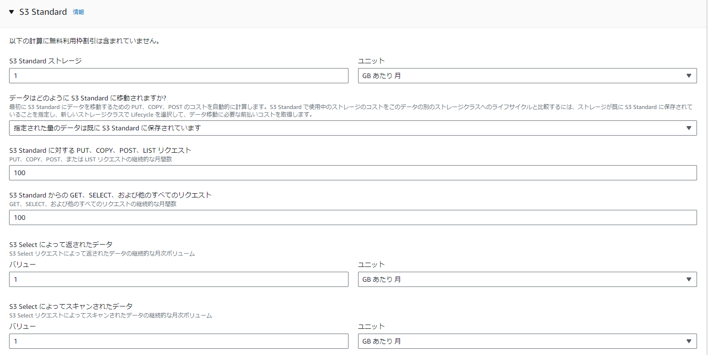

# AWSフルコース講座 第6回課題

# 実施内容

### CloudTrailで証跡の確認

AWS使用記録をCloudTrailのイベントから自身のIAM ユーザー名があるリストアップ  

  - イベント名：[GetEventSelectors](https://docs.aws.amazon.com/ja_jp/awscloudtrail/latest/userguide/logging-management-events-with-cloudtrail.html)  
      CloudTrailがこれまでに記録しているイベントを呼び出すイベント  
        

  - 主な内容：AWS上で、誰が、いつ、何をしたかを特定できる内容が含まれている
    - イベント時間
    - ユーザーID
    - エラーコード
    
      

### CloudWatchアラームによるメール通知

ALB のアラームを設定しメール通知
  - Amazon SNSの設定
    - 送付先メールで確認メールに回答し受信準備完了  
        

  - CloudWatchでアクション設定
    - Alertアクションの設定  
        

    - Railsアプリケーションを使えない状態にして動作確認  
        

    - Railsアプリケーションを使える状態にして動作確認  
        

### AWS利用料の見積書作成

課題5までに作成したリソース内容の見積[URL](https://calculator.aws/#/estimate?id=82dfc620e4444961a2ac08790249d0c4fb957a1d)  
    

### 料金確認

マネジメントコンソールから、EC2の利用料を確認
  - 請求期間: 3月1日 - 2024年3月31日
  - EC2は無料利用枠の中で使用中
  - VPCでパブリックIPアドレスの利用料が発生

    
    

# 所感

  - アラーム設定により監視の負担を大きく軽減できるが、アラートを上げる状態とはどのようなものか、明確に定義しておく必要がある点に注意する。
    - どのメトリクスを使うか、
    - どのような条件・閾値を置くか
    - 複数の条件を組み合わせる場合  etc.

# 備忘録

 作業工程 

- CloudTrail
  - イベントのリスト  
      

  - JSON形式のイベントレコード  
      

- Amazon SNS
  - トピック設定  
      

  - メール通知の受け取り設定  
      

  - ALERT状態に遷移した時、OK状態に遷移した時、それぞれのトピックを用意  
      

- CloudWatch
  - Alertアクションの設定  
      
      
      
      
      

  - OKアクションの設定  
      
      

  - アラームの有効かと無効化  
      
      

  - EC2を起動していない場合の表示  
      
      

- AWS Pricing Calculator
  - 見積もるリソースの選択  
      

  - EC2見積り  
      
      
      

    - EC2仕様情報  
        
        
        

  - RDS見積り  
      
      
      

    - RDS仕様情報  
        
        
        

  - VPC仕様情報  
    

  - VPC見積り  
      
      

  - S3見積り  
      
      

  - ALB見積り  
      
      

  - 課題5までに作成したリソース内容見積[URL](https://calculator.aws/#/estimate?id=ce1d019ab7dec12e96c39fe4b2a422c8d8e570c2)  

