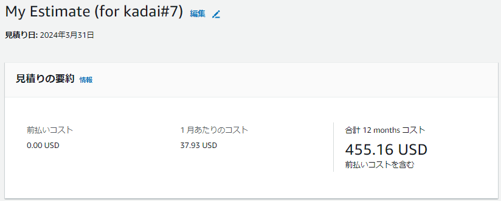
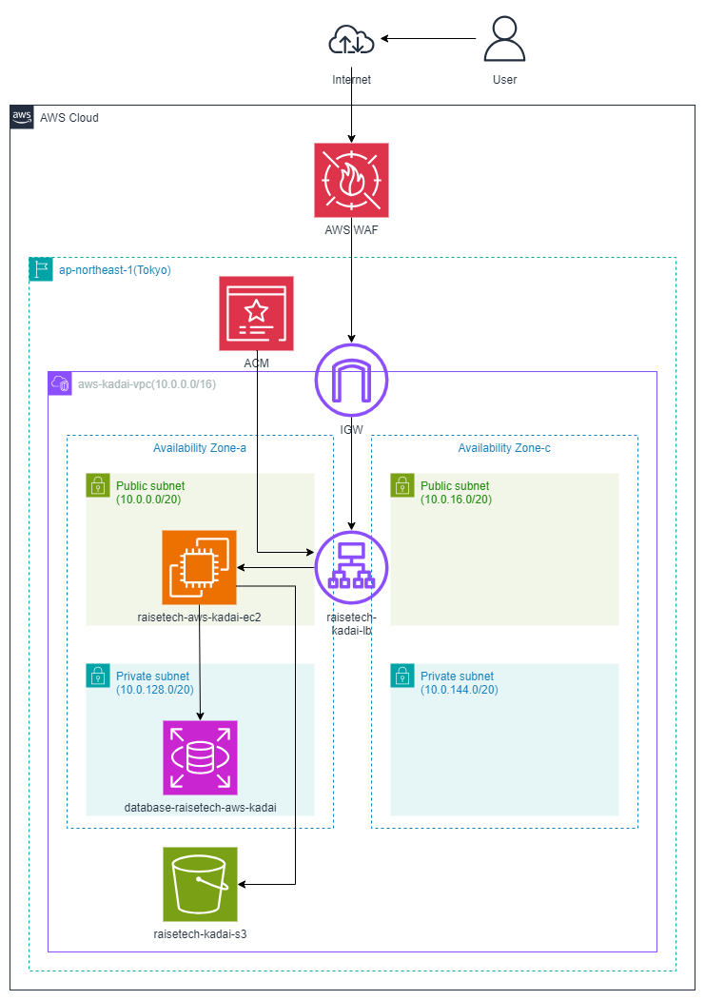
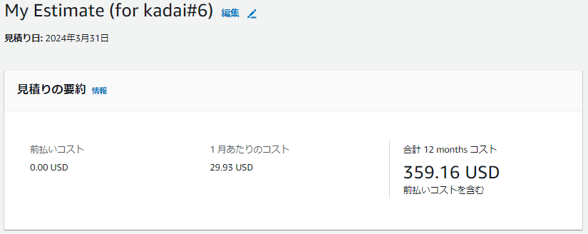

# AWSフルコース講座 第7回課題

## 実施内容

### 課題5で構築した環境のセキュリティリスク

|No.|セキュリティリスク|対策|
|--|--|--|
|1|HTTP通信であり暗号化していない|ACMを追加しHTTPS通信にする|
|2|SQLインジェクションやクロスサイトスクリプティングの対策をしていない|ALBにAWS WAFを追加し、関連する機能を有効化する \(参考：図1\)|
|3|S3をパブリックアクセスにしてしまう|S3のコンソール画面で公開になっていないことを確認する\(補足：デフォルトではブロックパブリックアクセスは有効であり設定変更をしない\) \(参考：図2\)|

- 図1: AWS WAF設定画面  
    

- 図2: S3設定画面  
    

### セキュリティ対策コスト

- 上記で検討したACMおよびAWS WAFを追加したリソース内容の見積 [URL](https://calculator.aws/#/estimate?id=6aed1fe3d49e85d4c690ab8b53b593153bd8dc9c)  
  利用条件にもよるが、決して安い追加コストとはいえないと認識する。  
  
    

  図3：構成図（ACMとAWS WAFを追加）
    

- （参考比較）課題5までに作成したリソース内容の見積（課題6として作成したもの）[URL](https://calculator.aws/#/estimate?id=5f893e60f6ecd9d3c84182d08804b11c1d16bf51)  
    

  図4：構成図（ACM・AWS WAF追加前）
    

## 所感

 - セキュリティ導入に当たっては、抜け漏れが無いか、AWS上の環境構築時にレビューを受けるなど、設計検討不足に起因するミスは防ぐようにしたい。
 - 過剰なセキュリティ対策はコストになるだけなので、取扱うデータの内容や重要性にあわせて、必要なセキュリティ対策を必要な分だけ導入できるよう知識をつけたい。
 - AWSのセキュリティ対策以前の基本的事項として、ソーシャルエンジニアリングや日常のパスワード管理など基本的な情報管理に注意する。

## 備忘録

 用語集 

- [責任共有モデル](https://aws.amazon.com/jp/compliance/shared-responsibility-model/)  
  AWSとAWS利用者との間の責任分担を規定するモデル  
    - AWSは、サービスを提供するインフラ\(ハードウェア、ソフトウェア、ネットワーキング、AWSクラウドのサービスを実行する施設で構成\)の保護について責任を負う。
    - AWSサービス利用者\(ユーザー\)は、AWS上に保管する個人情報、構成\(ファイアウォール、設置等\)、設定\(暗号化やアクセス制限等\)、監視\(利用実態把握\)などAWSサービスの使い方全般に責任を負う。

- AWSが提供している主要なセキュリティ対策サービス  
  - AWSリソースの構成・設定関連
    - [AWS Security Hub](https://docs.aws.amazon.com/ja_jp/securityhub/?icmpid=docs_homepage_security)  
      AWSのセキュリティ状態を設定情報から検索し継続的にチェックし、脆弱な部分を指摘。5段階のセキュリティ標準から1つ以上選択し適用。
      セキュリティイベントの集約管理\(Security Hubの結果をひとつのAWSアカウント・リージョンに集約可能\)
    - [IAM Access Analyzer](https://docs.aws.amazon.com/ja_jp/IAM/latest/UserGuide/what-is-access-analyzer.html)  
      [IAM](https://docs.aws.amazon.com/ja_jp/IAM/latest/UserGuide/introduction.html)の機能のひとつ。
      AWS CloudTrailのIAM操作履歴(90日まで)を基に必要最小限ポリシーの作成や、AWSベストプラクティスに対し設定ポリシーを検証し、過大な権限を与えていないかの確認が可能。
    - [Amazon Inspector](https://docs.aws.amazon.com/ja_jp/inspector/?icmpid=docs_homepage_security)  
      自動的にリソースを評価し、脆弱性やベストプラクティスからの逸脱がないかどうかを確認。重要度の順にセキュリティの所見を示した詳細なリストが作成される。
    - [Amazon GuardDuty](https://docs.aws.amazon.com/ja_jp/guardduty/?icmpid=docs_homepage_security)  
      CloudTrail、VPCフローログ\(EC2\)、DNSログなどを利用したモニタリングサービスで分析結果をHIGH\/MID\/LOWに分類。

  - アプリケーション・データ保護関連
    - [CodeGuru Reviewer](https://docs.aws.amazon.com/ja_jp/codeguru/latest/reviewer-ug/welcome.html)  
      Java/Pythonアプリケーションのパフォーマンス、効率、コード品質を向上するための推奨事項を提案する。
    - [Patch Manager](https://docs.aws.amazon.com/ja_jp/systems-manager/latest/userguide/patch-manager.html)  
      [AWS System Manager\(SSM\)](https://docs.aws.amazon.com/ja_jp/systems-manager/?icmpid=docs_homepage_mgmtgov)の機能のひとつ。
      セキュリティ関連およびその他の種類の更新について、OSやアプリケーションへのパッチ適用を自動化。
    - [Amazon Macie](https://docs.aws.amazon.com/ja_jp/macie/?icmpid=docs_homepage_security)  
      S3バケット内の機密データを検出、モニタリング、保護

  - ファイアウォール関連  
    - [AWS WAF\(Application Firewall\)](https://docs.aws.amazon.com/ja_jp/waf/?icmpid=docs_homepage_security)  
      AWSリソースに転送されるウェブリクエスト\(リクエスト発信元IPアドレス、リクエストコンポーネント etc.\)をモニタリングし管理する。  
    - [AWS Shield](https://docs.aws.amazon.com/ja_jp/waf/?icmpid=docs_homepage_security)  
      DDoS攻撃に対し保護を提供。Standardレベルは追加料金なしで自動組み込み。  
    - [Network Firwall](https://docs.aws.amazon.com/ja_jp/network-firewall/?icmpid=docs_homepage_security)  
      インターネットゲートウェイとVPCの境界に設置するファイアーウォール、および侵入検知および防止サービス。

  - 暗号化関連
    - [ACM\(Certificate Manager\)](https://docs.aws.amazon.com/ja_jp/acm/)  
      AWSリソースでのSSL/TLS証明書の準備、管理、デプロイを一元管理容易する。  
      他のAWSサービスと結合され、コンソール画面からSSL/TLS証明書の配置ができる。ELBやCloudFrontに適用。  
    - [AWS Key Management Service\(KMS\)](https://docs.aws.amazon.com/ja_jp/kms/?icmpid=docs_homepage_crypto) は、AWS の暗号鍵マネージドサービス  
      S3はじめAWSの他のサービスで使用される暗号化およびキー管理サービス。保管データの暗号化に加え、鍵自体の暗号化も行う。
    - [AWS Secrets Manager](https://docs.aws.amazon.com/ja_jp/secretsmanager/?icmpid=docs_homepage_security)  
      データベースやその他のサービスの認証情報を安全に暗号化、保存、取得。
      必要に応じSecrets Managerを呼び出し認証情報を取得することで、アプリケーションでの認証情報ハードコーディングを不要にする。
      RDSではDBのアクセスパスワード定期変更も可能。  

  - 監査・不正検知関連
    - [AWS Config](https://docs.aws.amazon.com/ja_jp/config/?icmpid=docs_homepage_mgmtgov)  
      構築したリソースの構成情報や変更履歴を記録、管理する。  
    - [AWS CloudTrail](https://docs.aws.amazon.com/ja_jp/cloudtrail/?icmpid=docs_homepage_mgmtgov)  
      アカウントのAWSサービスに対するAPI操作履歴を記録・保持する。  
    - [AWS CloudWatch](https://docs.aws.amazon.com/ja_jp/cloudwatch/?icmpid=docs_homepage_mgmtgov)  
      Amazon CloudWatch は、数分で使用を開始できる、信頼性、拡張性、および柔軟性あるモニタリングソリューションを提供。  
    - [AWS SNS\(Simple Notification Service\)](https://docs.aws.amazon.com/ja_jp/sns/?icmpid=docs_homepage_appintegration)  
      メッセージ配信を提供する\(CloudWatch Alarmや各種アプリケーションから、AWS運用担当者や別のアプリケーションへ\)
    - [Amazon Detective](https://docs.aws.amazon.com/ja_jp/detective/?icmpid=docs_homepage_security)  
      セキュリティ検出結果や疑わしいアクティビティを分析、調査し、その原因を特定する。

