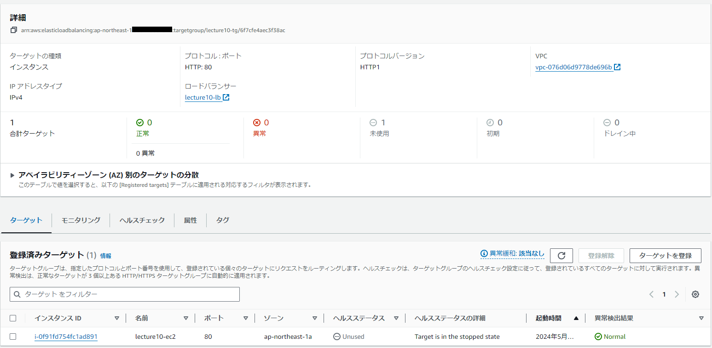
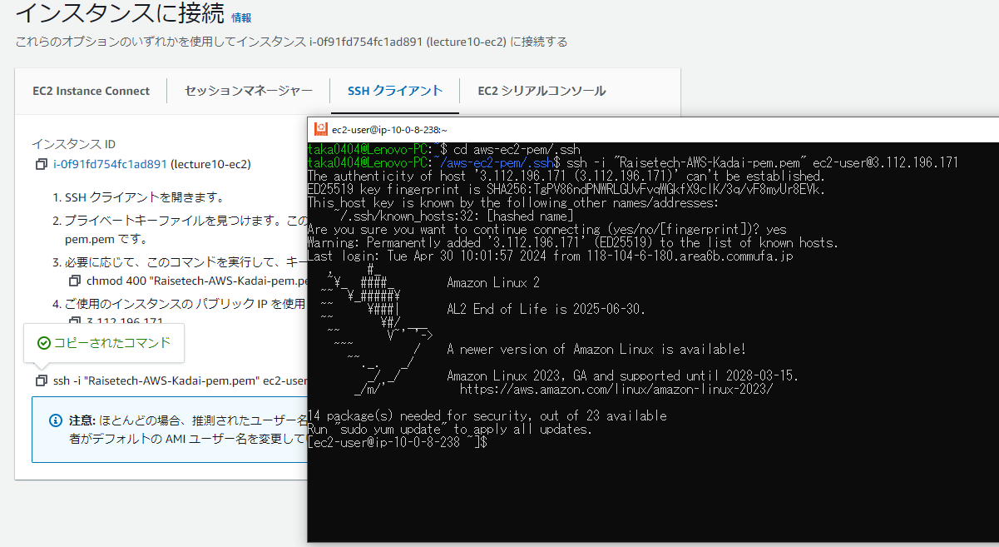
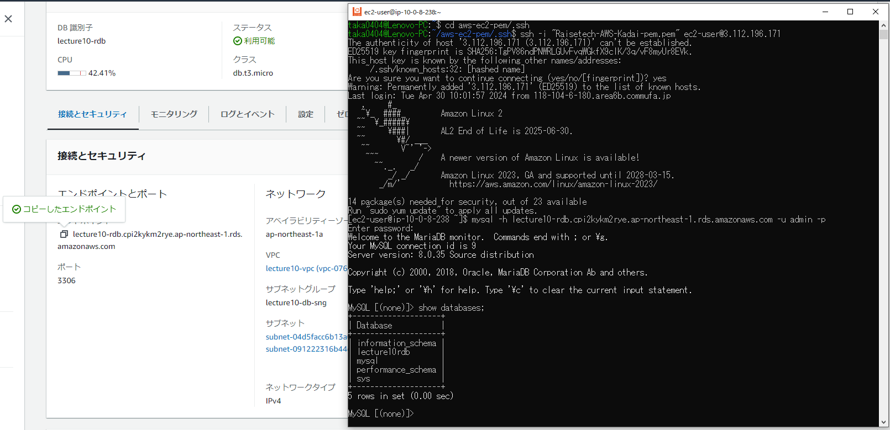

# AWSフルコース講座 第10回課題

## 実施内容

CloudFormation を利用して、これまで主導で作った環境をコード化

### 構成図

  

### Templateファイル

|Template File|Contents|
|--|--|
|[lect10-vpc.yml](templates_lec10/lect10-vpc.yml)|VPC、IGW、Security Group|
|[lect10-ec2.yml](templates_lec10/lect10-ec2.yml)|EC2 Instance, Network Interface|
|[lect10-alb.yml](templates_lec10/lect10-alb.yml)|ALB, Listener, Target Group|
|[lect10-rds.yml](templates_lec10/lect10-rds.yml)|RDS, DB Subnet Group|
|[lect10-s3.yml](templates_lec10/lect10-s3.yml)|S3、IAM Instance Profile、IAM Role(S3 Access)|
|[lect10-cw.yml](templates_lec10/lect10-cw.yml)|Cloud Watch Logs、IAM Role(FlowLog)|


### 実行結果詳細

1. CloudFormation スタック作成内容  
   
   
   


2. VPC設定内容  
     
     


3. EC2設定内容  
     
   
   


4. ALB設定内容  
     
     


5. RDS設定内容  
     
     


6. S3設定内容  
     
   


7. CroudWatch設定内容  
     
     


8. SNS設定内容  
     
     


9. 動作確認
  - EC2へのSSH接続  
     

  - EC2からRDSへの接続  
     


## 所感
  - テンプレート内で使用する変数は、ネーミングルールを予め決めておかないと、どの変数が何であるかが途中でわからなくなってくるので事前の整理が必要とわかった。
  - クロススタックを用いる場合は、スタックを作成・削除する際に依存関係の理由で先に作成・削除できなくなるので、複雑な依存関係にならないよう配慮する必要があるとわかった。


## その他
  - 追加として、第8回講座で説明されたEC2ネットワークインターフェイスへのフローログ設定もテンプレート反映にチャレンジしたが、以下経緯から現状困難と判断。
    - フローログのプロパティにはネットワークインターフェイスIDが必要　＜\[1\]参照＞  
      [lect10-cw-with-flowlog.yml](templates_lec10/lect10-cw-with-flowlog.yml)
      ```yml
      Lecture10FlowLogs:
        Type: AWS::EC2::FlowLog
        Properties:
          DeliverLogsPermissionArn: !GetAtt Lecture10RoleFlowLog.Arn
          LogDestinationType: cloud-watch-logs
          LogGroupName: !Ref Lecture10LogGroup
          ResourceId:   #--[1]--
            Fn::ImportValue:
              !Sub ${EnvironmentName}-network-interface
          ResourceType: NetworkInterface
          Tags:
            - Key: Name
              Value: !Sub ${EnvironmentName}-flwlg
          TrafficType: ALL
      ```
    - ネットワークインターフェイスのID取得には、EC2インスタンスとは別途作成が必要（GetAtt関数もネットワークインターフェイスIDの出力は対応していない）　＜\[2\]参照＞
    - 別途作成したネットワークインターフェイスを付与する場合、EC2インスタンスへのパブリックIPアドレス関連付けが不可能（Elastic IPの関連付けは可能だが、これまでの課題で作成した環境と異なってしまう）　＜\[3\]参照＞  
      [lect10-ec2-with-flowlog.yml](templates_lec10/lect10-ec2-with-flowlog.yml)  
      ```yml
      Lecture10EC2:
        Type: AWS::EC2::Instance
        Properties:
          AvailabilityZone:
            Fn::ImportValue:
             !Sub ${EnvironmentName}-availability-zone1
          IamInstanceProfile: !Ref Lecture10aInstanceProfile
          ImageId: ami-05b37ce701f85f26a
          InstanceInitiatedShutdownBehavior:
          InstanceType: t2.micro
          KeyName: !Ref KeyNameEC2
          Monitoring: False
          NetworkInterfaces:
            #- AssociatePublicIpAddress: true  #--[3]--
            - DeleteOnTermination: false
              Description: EC2 Instance for Lecture10
              DeviceIndex: 0
              NetworkInterfaceId: !Ref Lecture10NetworkInterface  #--[2]--
          Tags:
            - Key: Name
              Value: !Sub ${EnvironmentName}-ec2
          UserData:
            Fn::Base64: |
              #!/bin/bash
              sudo yum update -y
              sudo yum install mysql -y
        ``` 

  - 作成結果\(EC2インスタンス開始時にパブリックIPアドレスが付与されない\)  
       
       
       
       
