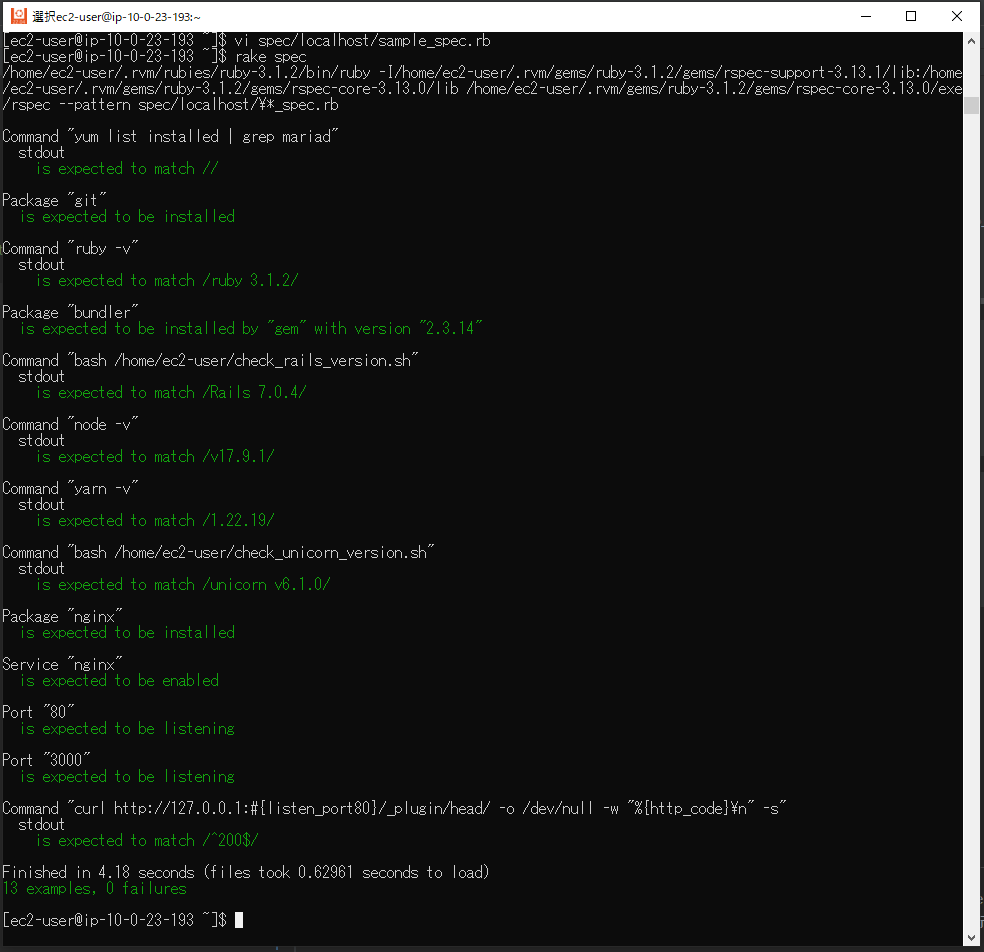
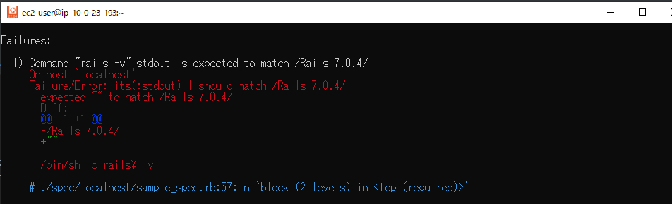
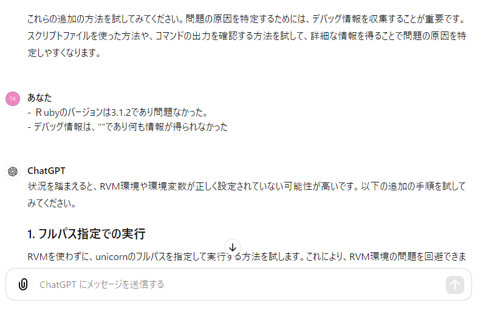
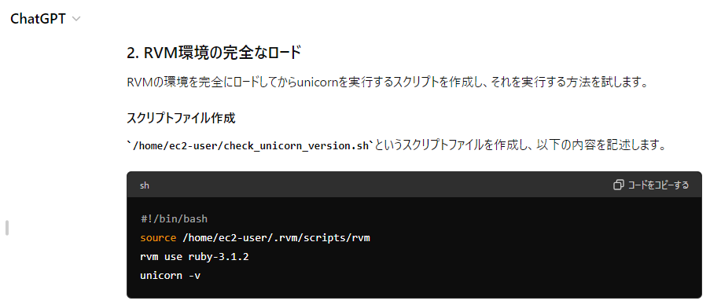

# AWSフルコース講座 第11回課題

## 実施内容

ServerSpec のテスト[サンプルコード](https://github.com/MasatoshiMizumoto/raisetech_documents/tree/main/aws/samples/serverspec)をカスタマイズしたうえで、テストを成功させる


### テストコード

- [課題5](https://github.com/SUZUKI-Takayuki-0404/RaiseTechAWS/blob/main/lecture05.md)の環境構築時に、インストール後に手作業で実施したソフトウェアのインストールおよびバージョン確認  
  - ソフトウェアがインストール済みであること
  - ソフトウェアバージョンが意図したものであること
  - 通信が成功すること

```ruby:sample.rb
    require 'spec_helper'
    
    listen_port80 = 80
    listen_port3000 = 3000
    
    # MariaDBがインストールされていないこと(＝検索結果に含まれない)
    describe command('yum list installed | grep mariad') do
      its(:stdout) { should match // }
    end
    
    # gitがインストールされていること
    describe package ('git') do
      it { should be_installed }
    end
    
    # Ruby のバージョンは3.1.2であること
    describe command('ruby -v') do
      its(:stdout) { should match /ruby 3.1.2/ }
    end
    
    # bundlerのバージョンは2.3.14であること
    describe package('bundler') do
      it { should be_installed.by('gem').with_version('2.3.14') }
    end
    
    #railsのバージョンは7.0.4であること
    describe command('bash /home/ec2-user/check_rails_version.sh') do
      its(:stdout) { should match /Rails 7.0.4/ }
    end
    
    # nodeのバージョンは17.9.1であること
    describe command('node -v') do
      its(:stdout) { should match /v17.9.1/ }
    end
    
    ## yarnのバージョンは1.22.19であること
    describe command('yarn -v') do
      its(:stdout) { should match /1.22.19/ }
    end
    
    # unicornのバージョンは6.1.0であること
    describe command('bash /home/ec2-user/check_unicorn_version.sh') do
      its(:stdout) { should match /unicorn v6.1.0/ }
    end
     
    # Nginxがインストール済であること
    describe package('nginx') do
      it { should be_installed }
    end
    
    # nginxの自動起動設定がenableになっているか
    describe service('nginx') do
      it { should be_enabled }
    end
    
    # ポート80番がリッスンであること
    describe port(listen_port80) do
      it { should be_listening }
    end
    
    # ポート3000番がリッスンであること
    describe port(listen_port3000) do
      it { should be_listening }
    end
    
    # テスト接続して動作すること
    describe command('curl http://127.0.0.1:#{listen_port80}/_plugin/head/ -o /dev/null -w "%{http_code}\n" -s') do
      its(:stdout) { should match /^200$/ }
    end

```

エラー対処のためスクリプトファイルとして実行\(Rails, Unicorn のバージョン確認\)
```cat check_rails_version.sh
# !/bin/bash

source /home/ec2-user/.rvm/scripts/rvm
rvm use ruby-3.1.2
rails -v

```

```cat check_unicorn_version.sh
# !/bin/bash

source /home/ec2-user/.rvm/scripts/rvm
rvm use ruby-3.1.2
unicorn -v

```


### 実行結果

  テスト成功を確認  
    

## 所感

  - 構築したい環境に対し、予めどんな確認事項（＝テスト項目）が要るか洗い出しておくことで、今回のようにテストの自動化をはかることで手戻り削減につながる。  
  - 今回の手戻り事例：テスト実行時の予期せぬエラーの解決に多大な時間（６作業日）を要した  
    - 事象  
      - Bundler、Rails、Unicornのバージョン確認時、コマンドライン入力では正しく出力されているがServerspecでは出力されない。Serverspecの環境変数が関係すると考え、whichコマンドで環境変数のパス確認結果も不一致のエラー表示。  
          
          
    - 処置  
      - whichコマンドの問題は、期待値（出力結果）のパスに使っていたチルダ（ホームディレクトリ）をフルパス表記に置換することで解決  
          
          
      - Bundlerについては、Serverspecはdefault versionを参照していることがわかり、gemのバージョンを変更することでbundlerのデフォルトバージョンを整合させて解決  
          
          
      - RailsおよびUnicornは、Serverspecにスクリプトファイルを読み込ませることで解決。環境変数の修正策を出来るだけ多く集めるためChatGPTを使用。検討し得る策を提示させ、その実行結果をインプットに追加して探索範囲を狭めながら検討。  
          
          
