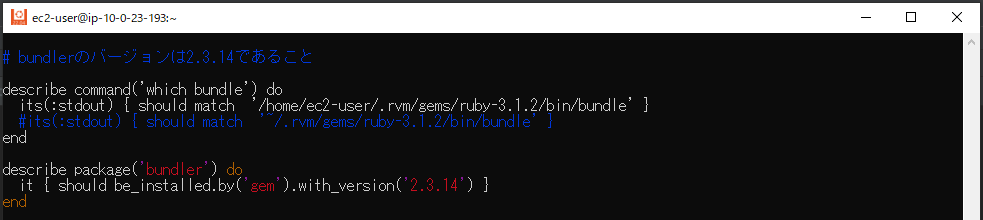
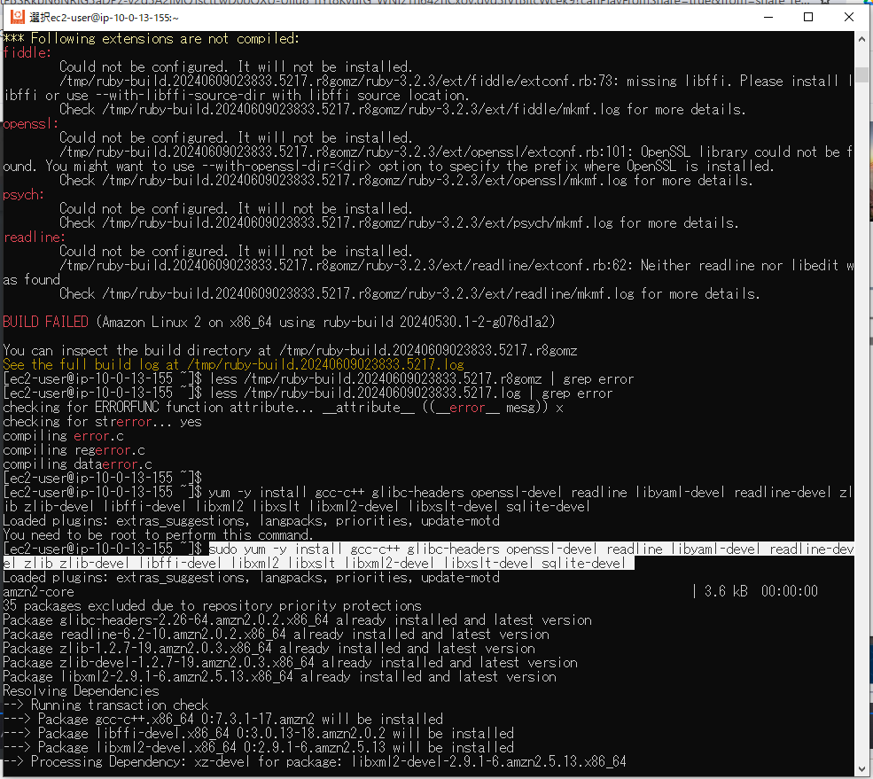
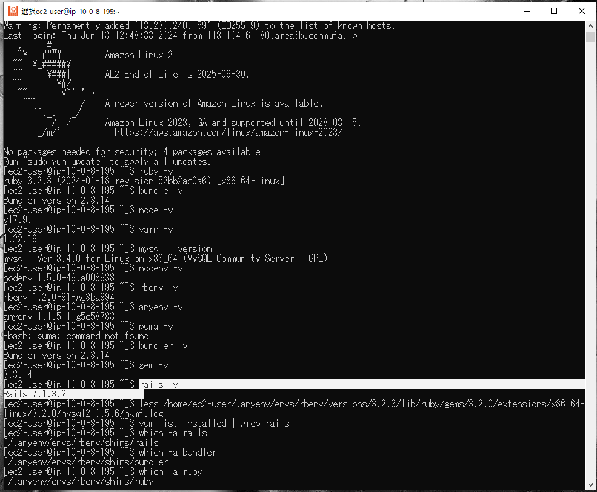
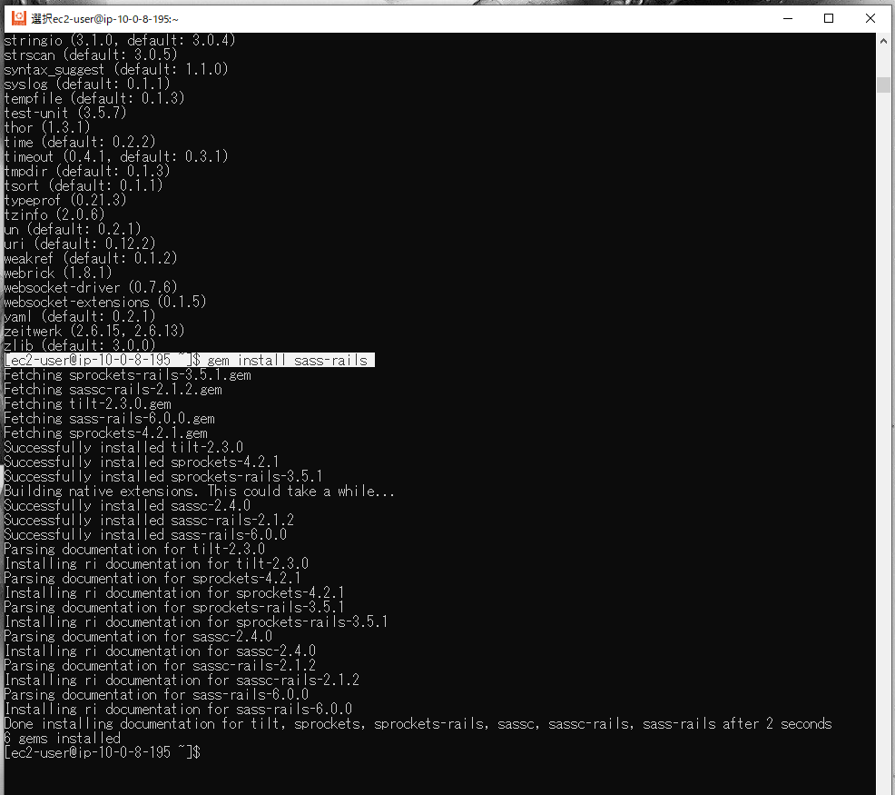
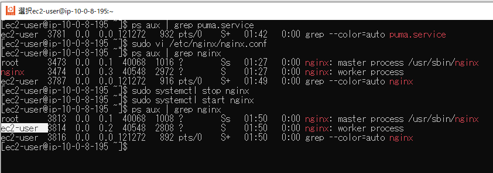

# AWSフルコース講座 第11回課題

## 実施内容

Serverspec のテスト[サンプルコード](https://github.com/MasatoshiMizumoto/raisetech_documents/tree/main/aws/samples/serverspec)をカスタマイズしたうえで、テストを成功させる


### テストコード

> [!NOTE]  
> サンプルアプリ更新に伴いテスト項目見直し（Unicorn除外、Systemd追加）

- [課題5](https://github.com/SUZUKI-Takayuki-0404/RaiseTechAWS/blob/main/lecture05.md)の環境構築時に、インストール後に手作業で実施したソフトウェアのインストールおよびバージョン確認  
  - ソフトウェアがインストール済みであること
  - ソフトウェアバージョンが意図したものであること
  - 通信が成功すること
  
  ```
  require 'spec_helper'
  
  listen_port80 = 80
  listen_port3000 = 3000
  
  # MariaDBがインストールされていないこと(＝検索結果に含まれない)
  describe command('yum list installed | grep mariad') do
    its(:stdout) { should match '' }
  end
  
  # gitがインストールされていること
  describe package ('git') do
    it { should be_installed }
  end
  
  # ruby のバージョンは3.1.2であること
  describe command('ruby -v') do
    its(:stdout) { should match 'ruby 3.2.3' }
  end
  
  # bundlerのバージョンは2.3.14であること
  describe package('bundler') do
    it { should be_installed.by('gem').with_version('2.3.14') }
  end
  
  # railsのバージョンは7.0.4であること
  describe package('rails') do
    it { should be_installed.by('gem').with_version('7.1.3.2') }
  end
  
  # nodeのバージョンは17.9.1であること
  describe command('node -v') do
    its(:stdout) { should match 'v17.9.1' }
  end
  
  # yarnのバージョンは1.22.19であること
  describe command('yarn -v') do
    its(:stdout) { should match '1.22.19' }
  end
  
  #ImageMagick7がインストール済であること
  describe package('systemd') do
      it { should be_installed }
  end
  
  # Systemdがインストール済であること
  describe package('systemd') do
    it { should be_installed }
  end
  
  # Nginxがインストール済であること
  describe package('nginx') do
    it { should be_installed }
  end
  
  # nginxの自動起動設定がenableになっているか
  describe service('nginx') do
    it { should be_enabled }
  end
  
  # ポート80番がリッスンであること
  describe port(listen_port80) do
    it { should be_listening }
  end
  
  # ポート3000番がリッスンであること
  describe port(listen_port3000) do
    it { should be_listening }
  end
  
  # テスト接続して動作すること(ステータスコード200)
  describe command('curl http://127.0.0.1:#{listen_port80}/_plugin/head/ -o /dev/null -w "%{http_code}\n" -s') do
    its(:stdout) { should match /^200$/ }
  end
  ```

### 実行結果

  テスト成功を確認  
    

## 所感

  - 構築したい環境について予めどのような確認事項（＝テスト項目）が要るか洗い出しておき、インストール直後に自動テストすることで、後から問題発覚で工数大幅ロスを防げる。  
  - 今回の手戻り事例：
    - テスト実行時のエラー解決に多大な時間（８作業日）を要した。
    - 途中からChatGPT使用し、狭い知識範囲で思いつきの解決策ではなく、より広範な知識に基づく多種多様かつ網羅的な解決策を検討できた。  
    - 事象：  
      - Bundlerのバージョン確認時、コマンドライン手入力では正しく出力されているが、Serverspecでは別バージョンが表示。
      - Serverspecの環境変数が関係すると考え、Bundlerについてwhichコマンドで確認すると、パスが不一致。  
          
    - 処置：  
      - whichコマンドの問題は、期待値（出力結果）のパスに使っていたチルダ（ホームディレクトリ）をフルパス表記に置換することで解決。（＝テストコード不備でありバージョンの問題とは無関係）  
          
          
      - Bundlerについては、Serverspecはdefault versionを参照していることがわかり、gemのバージョンを変更することでbundlerのデフォルトバージョンを整合させて解決  
          
          


## 備忘録

<details>
<summary>作業工程(新サンプルアプリ対応)</summary>

- MySQL  
  - Maria DBの削除  
    ```
    sudo yum remove -y mariadb-*
    ```
  - MySQLのインストール [参考](https://dev.mysql.com/doc/refman/8.4/en/linux-installation-yum-repo.html)  
    ```
    sudo yum localinstall https://dev.mysql.com/get/mysql84-community-release-el7-1.noarch.rpm
    ```
    ```
    sudo yum install -y mysql-community-server
    ```
      
    > [!IMPORTANT]
    anyenvの後にインストールしたところ、依存関係によるエラーが発生し解消できなかったので、一からやり直して先にインストール
      
  - mysql-develのインストール（mysql_configコマンド追加）  
    ```
    sudo yum -y install mysql-devel
    ```
    

- git
  - インストール
    ```
    sudo yum -y install git
    ```

- anyenv
  - rubyのインストール時に必要なパッケージをインストール 
    ```
    sudo yum -y install gcc-c++ glibc-headers openssl-devel readline libyaml-devel readline-devel zlib zlib-devel libffi-devel libxml2 libxslt libxml2-devel libxslt-devel sqlite-devel mysql-server perl-IPC-Cmd
    ```
      
  - anyenvのインストール
    ```
    git clone https://github.com/anyenv/anyenv ~/.anyenv
    ```
      
  - 環境変数追加
    ```
    echo 'export PATH="$HOME/.anyenv/bin:$PATH"' >> ~/.bash_profile
    ```
    ```
    source ~/.bash_profile
    ```
    ```
    echo 'export PATH="$HOME/.anyenv/bin:$PATH"' >> ~/.bashrc
    ```
    ```
    source ~/.bashrc
    ```
  - anyenvの初期設定
    ```
    ~/.anyenv/bin/anyenv init
    ```
    ```
    #eval "$(anyenv init -)" を#vimコマンドでファイル末尾に追加
    vim ~/.bash_profile
    ```
    ```
    anyenv install --init
    ```
  - rbenvをインストール
    ```
    anyenv install rbenv
    ```
      
  - nodenvのインストール
    ```
    anyenv install nodenv
    ```
      
    ```
    exec $SHELL -l
    ```
  - rbenvをバージョン指定でインストール
    ```
    rbenv install 3.2.3
    ```
      
  - nodenvをバージョン指定でインストール
    ```
    nodenv install 17.9.1
    ```
  - nodenvの環境変数追加
    ```
    echo 'export PATH="$HOME/.nodenv/bin:$PATH"' >> ~/.bashrc
    ```
    ```
    source ~/.bashrc
    ``` 
    ```
    echo 'export PATH="$HOME/.nodenv/bin:$PATH"' >> ~/.bash_profile
    ```
    ```
    source ~/.bash_profile
    ```
  - 初期設定
    ```
    ~/.nodenv/bin/nodenv init
    ```
  - bundlerをバージョン指定でインストール
    ```
    gem update --system 3.3.14
    ```
  - railsのインストール
    ```
    gem install rails -v 7.1.3.2
    ```
    > [!IMPORTANT]
    インストール成功したにもかかわらず、エラー表示が出た場合は、EC2再起動で治る場合あり
      
      
- yarn
  - yarnをバージョン指定でインストール
    ```
    npm install --location=global yarn@1.22.19
    ```
    ```
    nodenv rehash
    ```
    > [!IMPORTANT]
    bin/devコマンド時に[yarnのエラーが出た場合](https://classic.yarnpkg.com/en/docs/cli/run)は実行
      
      
    ```
    yarn install    
    ```

- raisetech-live8-sample-app
  - クローン
    ```
    git clone https://github.com/yuta-ushijima/raisetech-live8-sample-app.git
    ```
      
  - database.ymlの設定
    ```
    cd ~/raisetech-live8-sample-app/config
    cp config/database.yml.sample config/database.yml
    vim config/database.yml
    ```
      
  - RDSのuser \/ password \/ host(エンドポイント) \/ socketパスを更新
      
      
      
  - 初期設定
    ```
    bin/setup
    ```
      
    > [!NOTE]
    不足分のパッケージ(sassc2.4.0)のインストールが終わらなくなってしまうブルが発生。  
    追加インストールするパッケージの一つを個別にインストールした後、bin/devコマンドを実行したところ成功
      
      
  - 起動
    ```
    bin/dev
    ```
      
  - EC2のパブリックIPアドレス：3000番ポートでアプリを開く
      
    アプリは起動しデータ登録可能だが、画像が正しく表示されない  
      
- ImageMagic  
    
  - epelのインストール
  ```
  sudo amazon-linux-extras install epel
  ```
    
    
  - Remi Repositoryのインストール
  ```
  sudo yum install epel-release
  ```
  ```
  sudo rpm -Uvh http://rpms.famillecollet.com/enterprise/remi-release-7.rpm`
  ```
  
  - ImageMagickに必要なその他パッケージのインストール
  ```
  sudo yum install fftw3
  ```
    
  ```
  sudo yum install libraqm
  ```
    
  ```
  sudo yum install --enablerepo=remi ImageMagick7 ImageMagick7-devel
  ```
    
  - 以下パッケージも追加
  ```
  sudo yum install vips vips-devel vips-tools
  ```
    
    
  
- systemd
  - 定義ファイル`samples/puma.service`を`/etc/systemd/system`にコピー
    ```
    cd /etc/systemd/system
    sudo cp ~/raisetech-live8-sample-app/samples/puma.service.sample ./puma.service
    ```
      
  - 起動
    ```
    sudo systemctl start puma.service
    ```
      
  - パブリックIPでアクセスしbin/devコマンド無しでアクセスを確認
      
- Nginx
  - インストール
    ```
    amazon-linux-extras | grep "nginx"
    ```
    ```
    sudo amazon-linux-extras install nginx1
    ```
      
  - 起動
    ```
    sudo systemctl start nginx
    ```
      
    パブリックIPに80番ポートでアクセス
      
  - 設定変更
    バーチャルホストの設定を以下ディレクトリにアプリ名.confとして作成  
    ```
    sudo vi /etc/nginx/conf.d/app.conf
    ```
      
      
      
    Bad Gatewayが表示され、エラーログを確認  
      
    Nginxの動作設定  
    ```
    sudo vi /etc/nginx/nginx.conf
    ```
      
      
    パブリックIPでアクセスしアクセスを確認すると、表示が崩れている
      
    `config/environments/development.rb`の以下設定追加後、CSS有効化のため以下コマンド実行  
    ```
    bin/rails assets:precompile
    ```
      
      
  - 再度確認すると問題なく表示
      
- Serverspec
  - インストール
      
      


- 操作用\/情報確認用コマンド
  - Maria DB（有無確認）  
    ```
    yum list installed | grep mariadb
    ```
  - MySQL
    ```
    sudo systemctl start mysqld
    ```
    ```
    sudo service mysqld stop
    ```
    ```
    systemctl status mysqld.service
    ```
    ```
    mysql --version
    ```
      
    ```
    mysql -u admin -h endpoint -p
    ```
      
  - mysql-devel
    ```
    whereis mysql_config
    ```
    ```
    #sockeetファイルのパス確認
    mysql_config --socket
    ```
      
    ```
    mysql_config
    ```
    
  - ruby\/bundler\/rails\/node\/yarn
    ```
    gem list ruby
    gem list bundler
    gem list rails
    ```
    ```
    ruby -v
    bundler -v
    rails -v
    node -v
    yarn -v
    ```
  - ImageMagick
    ```
    sudo yum list --enablerepo=remi,epel | grep ImageMagick
    ```
    
  - Systemd
    ```
    sudo systemctl start puma.service
    ```
    ```
    sudo systemctl stop puma.service
    ```
    ```
    systemctl status puma.service
    ```
    EC2インスタンス起動時とあわせた自動起動ON/OFF
    ```
    sudo systemctl enable puma.service
    ```
    ```
    sudo systemctl disable puma.service
    ```
  - Nginx
    ```
    sudo vi /etc/nginx/nginx.conf
    ```
    ```
    sudo vi /etc/nginx/conf.d/app.conf
    ```
    ```
    sudo systemctl start nginx
    ```
    ```
    sudo systemctl stop nginx
    ```
    ```
    systemctl status nginx
    ```
    プログラムの実行ユーザー確認
    ```
    ps aux | grep nginx
    ```
    EC2インスタンス起動時とあわせた自動起動ON/OFF
    ```
    sudo systemctl enable nginx
    ```
    ```
    sudo systemctl disable nginx
    ```
  - エラー時は以下を確認
    ```
    sudo cat /var/log/nginx/error.log
    ```
    ```
    sudo nginx -t    
    ``` 

</details>
