# AWSフルコース講座 第12回課題

## 実施内容

CircleCI の[サンプルコンフィグ](https://github.com/MasatoshiMizumoto/raisetech_documents/tree/main/aws/samples/circleci)が正しく動作するようにRepositoryに組み込む

### 実施結果

[](https://dl.circleci.com/status-badge/redirect/gh/SUZUKI-Takayuki-0404/RaiseTechAWS/tree/main)

- CircleCIによるテストを全てパスできた事を確認した  
  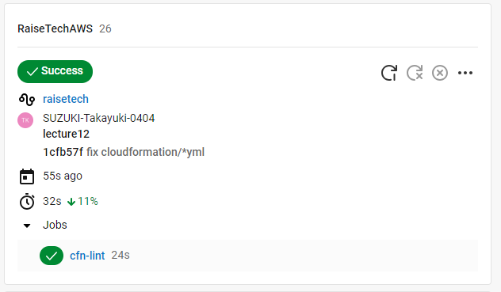  

### 所感

- GitHub Actionsと同様、push後は自動でCloudFormationのテンプレートファイルをテストしてくれるので、コードの不備確認が楽になる
- エラーだけでなくハードコーディングも指摘もされるので、パスワード漏洩防止などセキュリティの観点でも有益
- CircleCIが出したエラーメッセージについては、（他のプログラムでも同様であるが）どこが問題かわかっても、どのように問題かまではわからない場合もあり、修正時はよく確認が必要
  - 例えば、大文字・小文字の誤記がエラー（E3002、E3014）の原因だが、エラーメッセージにはそう書かれていない場合など  
    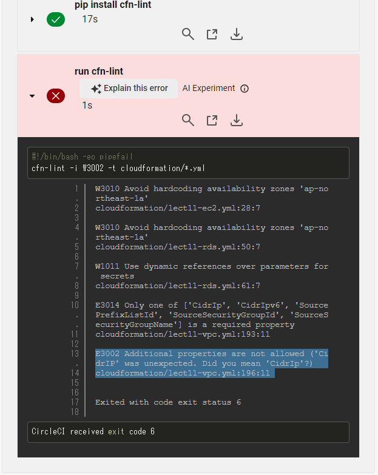  
    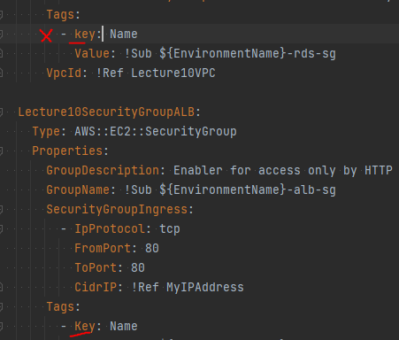
    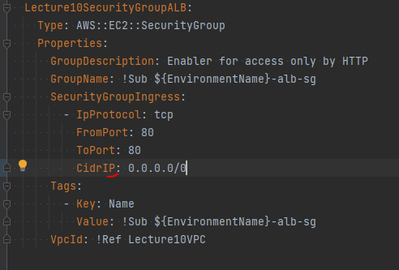  

## 備忘録

<details>
<summary>作業工程</summary>

- CircleCIのアカウントを作成する。
- [公式ドキュメント](https://circleci.com/docs/ja/getting-started/)にしたがいHello Worldのコンフィグを作成すろと、課題のRepositoryに新ブランチが自動生成される。
- ブランチ名を変更し、ローカルにfetchコマンドで取り込む。
  ```
  git fetch origin lecture12
  ```
  ```
  git checkout lecture12
  ```
- config.ymlを本課題のサンプルコンフィグに書き換え  
    
- pushすると自動でテスト開始  
  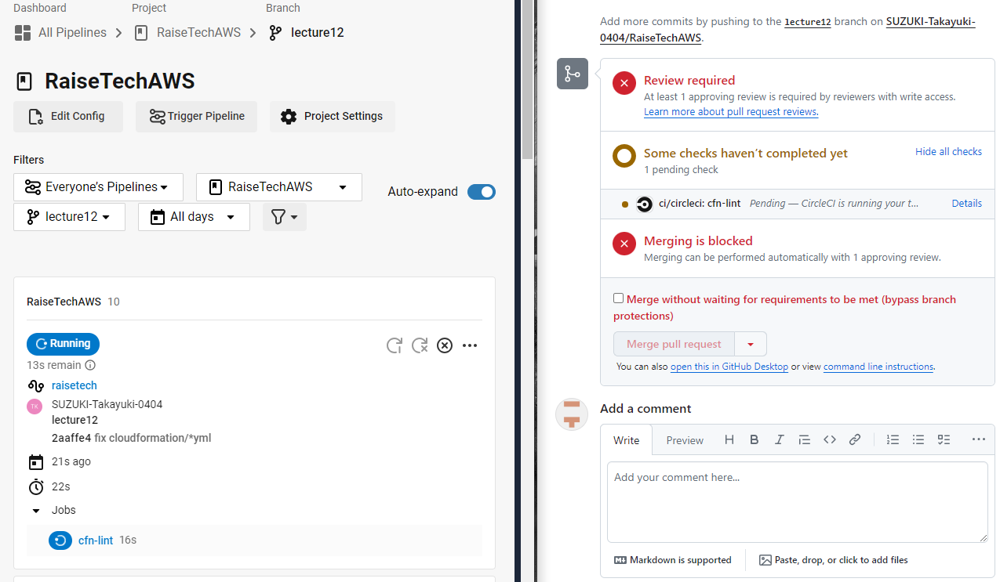  
- `Template file not found: cloudformation/*.yml`とエラー指摘  
  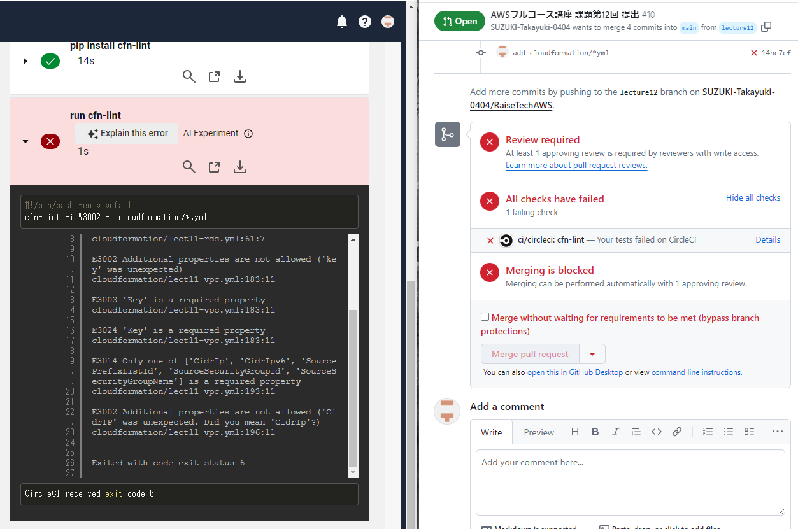  
- 指定のディレクトリとテンプレートファイルとを用意し再びpushすると、ymlファイル内のエラー指摘  
    
- テンプレートファイルの大文字・小文字の誤記修正し、エラー2件解消  
    
    
- Availability Zoneのハードコーディングに対するウォーニングを一つ解消  
  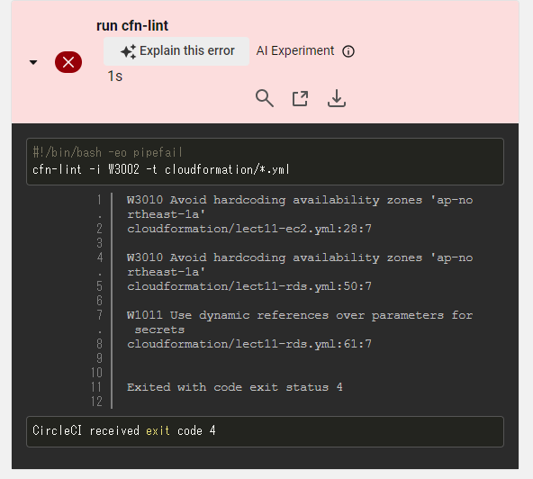  
  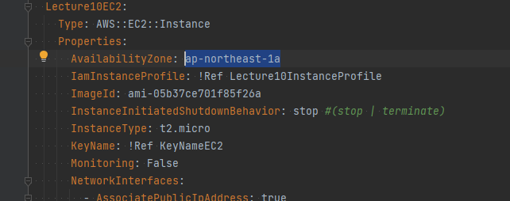  
  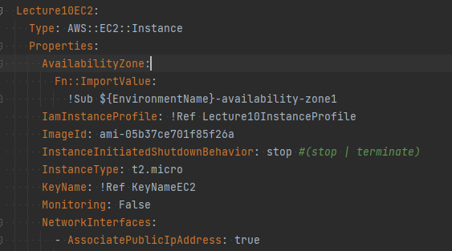  
- RDSのパスワードをパラメータとしてスタック作成時に入力としていたが、動的参照に変更  
  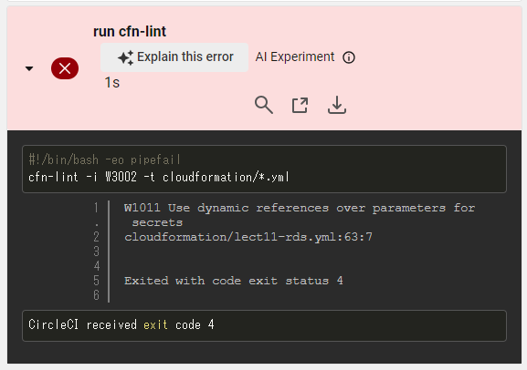  
  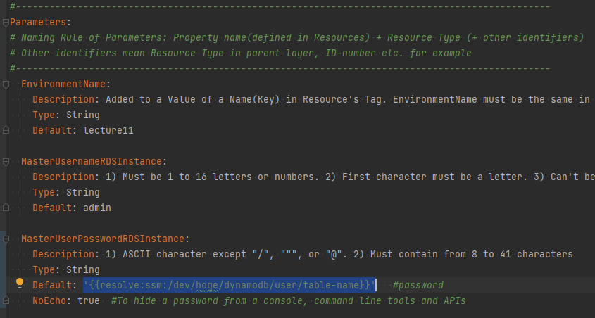  
- ウォーニングに変化が無いので、パラメータをでの記載をやめ、リソース中で動的参照に変更  
  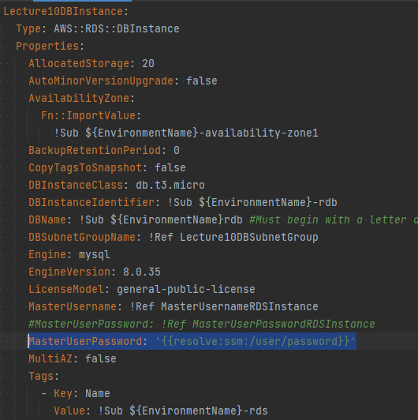  
- 安全な動的参照を要求されたので見直し  
  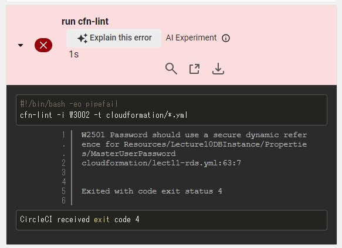  
  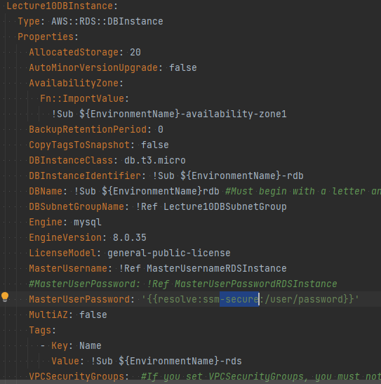  
- テスト通過  
    

</details>
