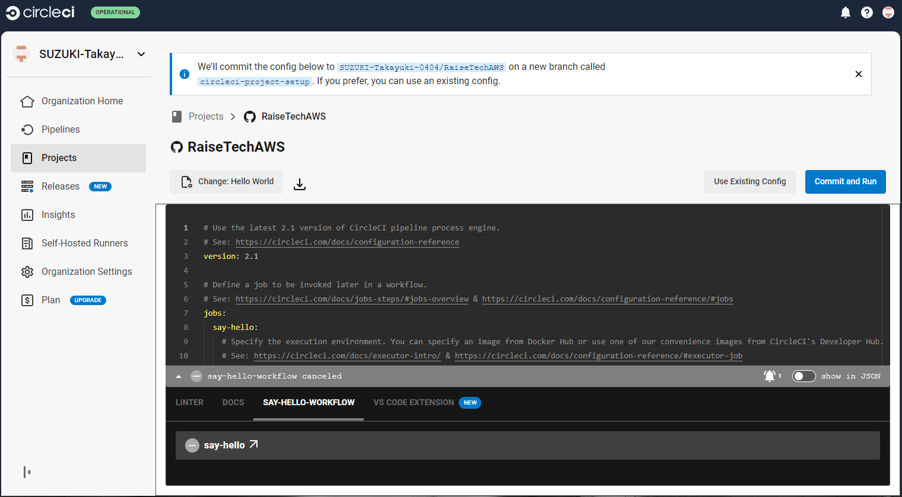

# AWSフルコース講座 第12回課題

## 実施内容
- サンプルコンフィグが正しく動作するようにしてRepositoryに組み込んだ状態
- 
## 所感

## 備忘録

<details>
<summary>作業工程</summary>

- CircleCIのアカウントを作成する。
- [公式ドキュメント](https://circleci.com/docs/ja/getting-started/)にしたがって進める。
- 課題のRepositoryに新ブランチが自動で作成される。
- ブランチ名を変更し、ローカルにfetchコマンドで取り込む。
  ```
  git fetch origin lecture12
  ```
  ```
  git checkout lecture12
  ```
- config.ymlを本課題の[サンプルコンフィグ](https://github.com/MasatoshiMizumoto/raisetech_documents/tree/main/aws/samples/circleci)に書き換える。
    
- pushすると、`Template file not found: cloudformation/*.yml`とエラー指摘
    
- 指定のディレクトリとテンプレートファイルとを用意しpushすると、ymlファイル内のエラー指摘
  
- 

</details>
