# AWSフルコース講座 第13回課題

## 実施内容


### 実施結果

### 所感

## 備忘録

<details>
<summary>作業工程</summary>
</details>

- Ansibleのインストール (Ubuntu 22.04 LTS)
  - インストール準備とインストール
    ```
    sudo apt-get update
    ```
    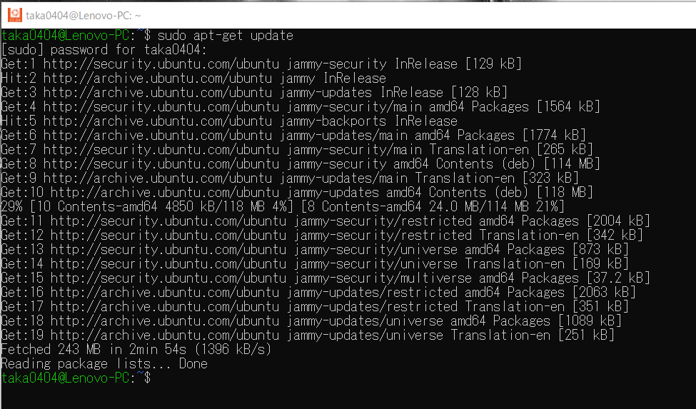  
    ```
    sudo apt-get install software-properties-common
    ```
    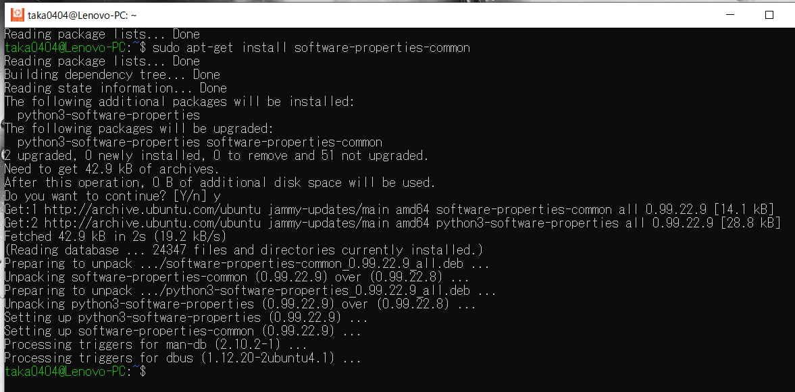  
    ```
    sudo apt-add-repository --yes --update ppa:ansible/ansible
    ```
    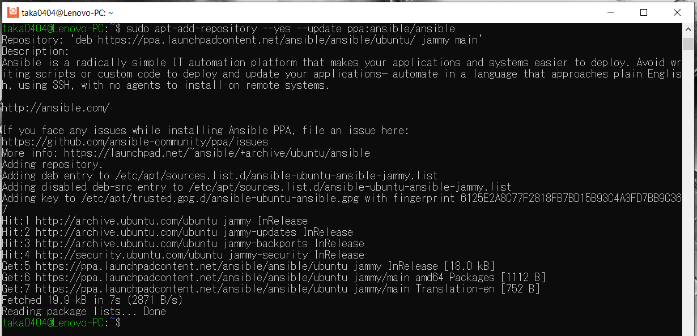  
    ```
    sudo apt-get install ansible
    ```
    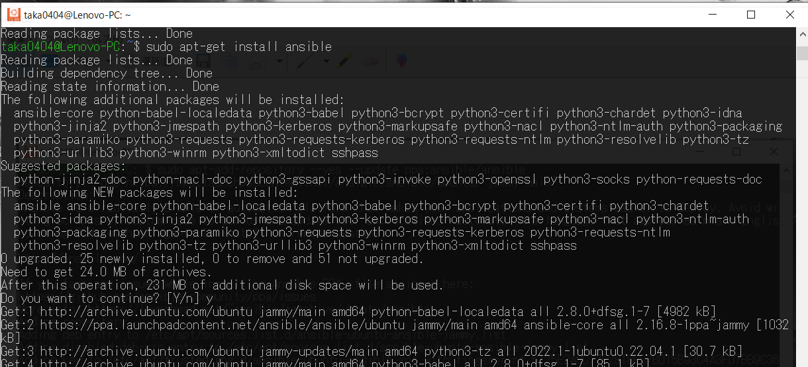  
    ```
    ansible --version
    ```
    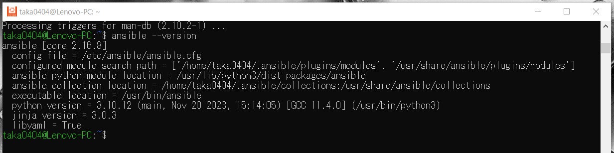  
- Ansibleによる環境構築  
  - 階層構造  
    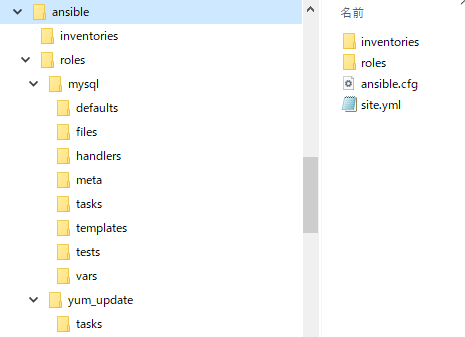  
  - Playbookの作成 `site.yml`  
    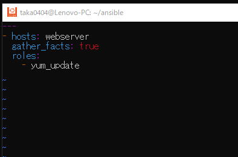  
  - Role
    - yum update (`sudo yum update`に相当)  
      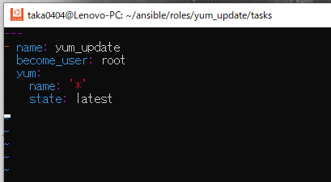  
    - Rolesの階層は以下コマンドで作成可(ansible ディレクトリで実行)
      ```
      ansible-galaxy init roles/<Rile名>
      ```
      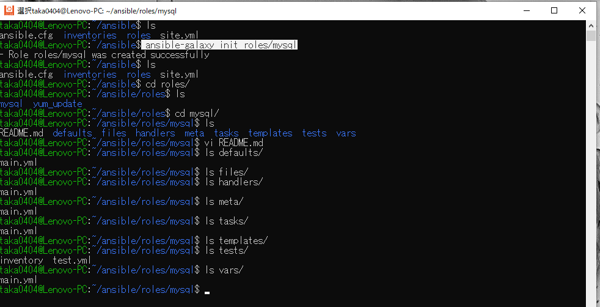  
  - Inventoryの作成
    - ターゲットノード(EC2)のIPアドレスとユーザー名を定義⇒ドライランでエラー発生
      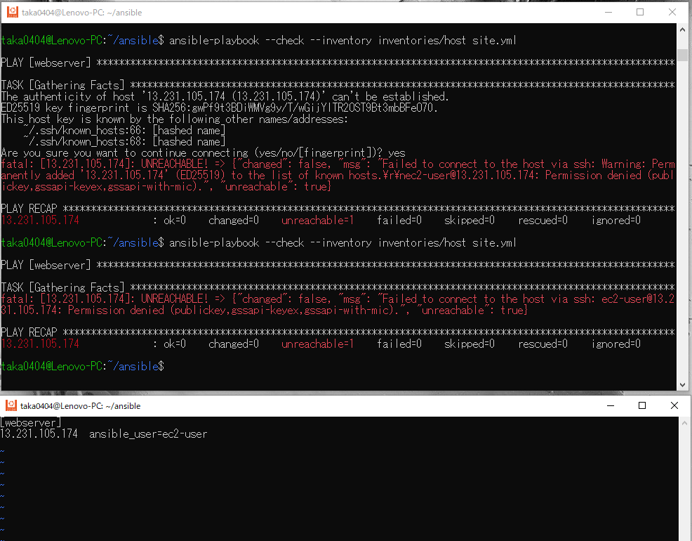  
    - ポート番号を追加で定義⇒ドライランでエラー発生
      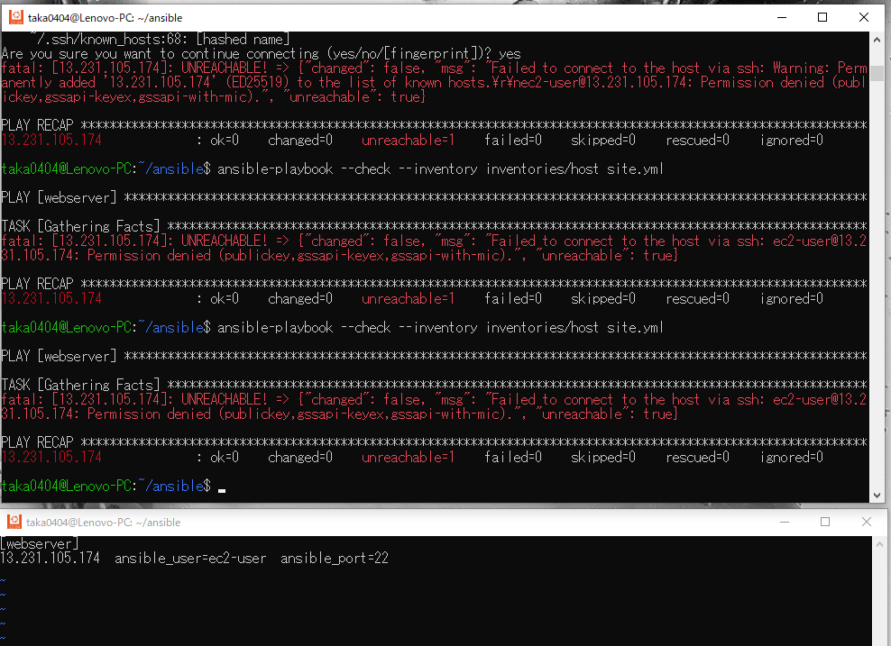  
    - SSH接続用のpemキーのパスを追加⇒OK
      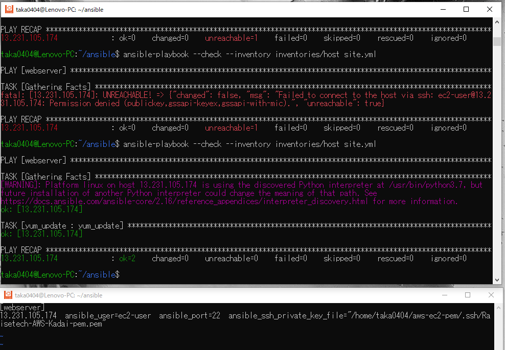  
  - Ansible.cfgの作成
    - Inventoryファイルのパスを追加し、`ansible-playbook`コマンド時の追記を省略
      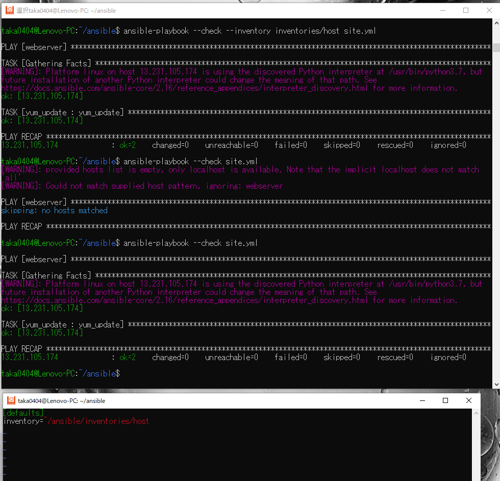  

> [!NOTE]  
> サンプル

> [!TIP]  
> サンプル

> [!IMPORTANT]  
> サンプル

> [!WARNING]  
> サンプル

> [!CAUTION]  
> サンプル

 
