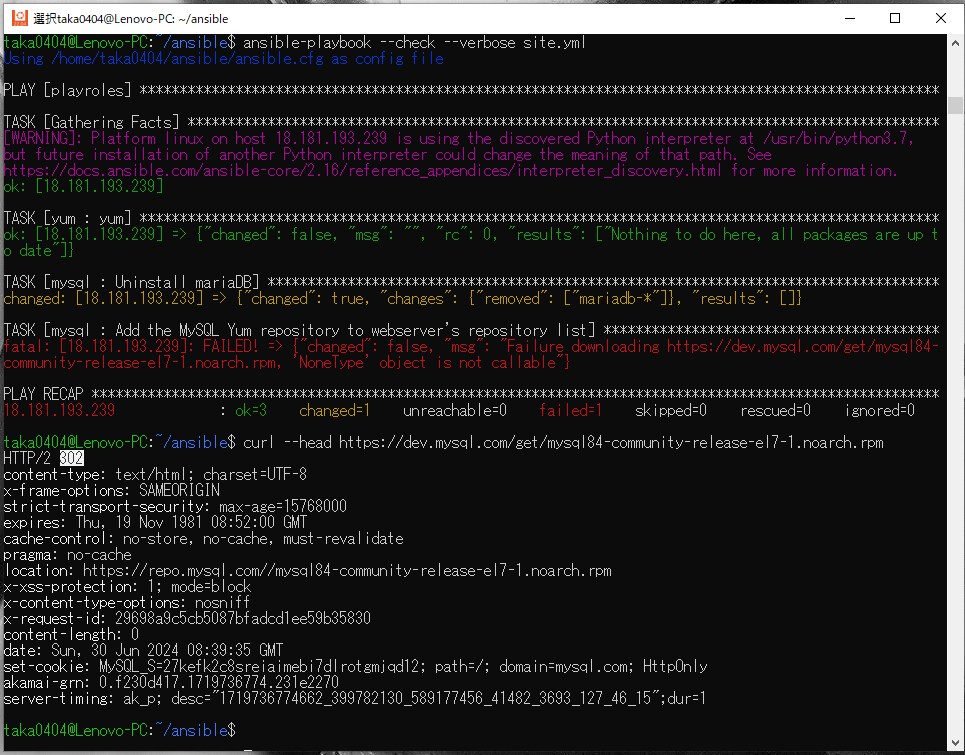
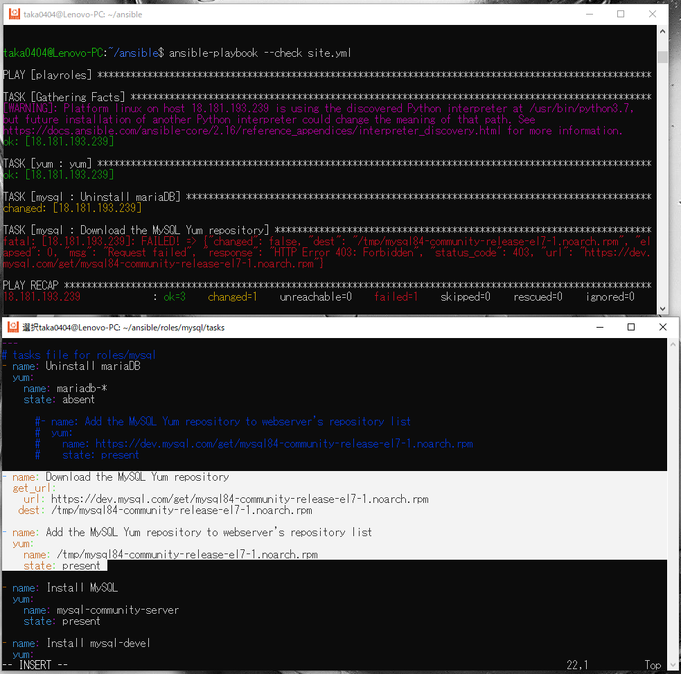
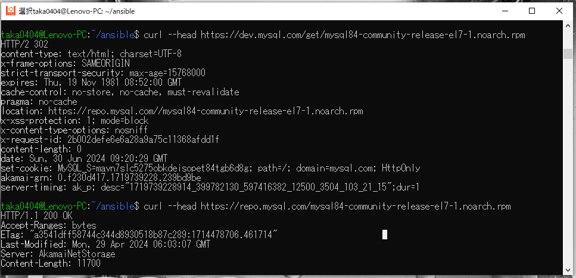
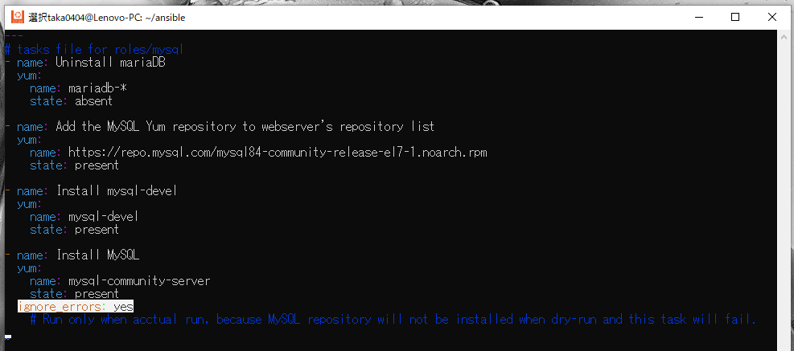

# AWSフルコース講座 第13回課題

## 実施内容


### 実施結果

### 所感

## 備忘録

<details>
<summary>作業工程</summary>
</details>

- Ansibleのインストール (Ubuntu 22.04 LTS)
  - インストール準備とインストール
    ```
    sudo apt-get update
    ```
      
    ```
    sudo apt-get install software-properties-common
    ```
      
    ```
    sudo apt-add-repository --yes --update ppa:ansible/ansible
    ```
      
    ```
    sudo apt-get install ansible
    ```
      
    ```
    ansible --version
    ```
      
- Ansibleによる環境構築準備  
  - 階層構造  
      
  - Playbookの作成 `site.yml`  
      
  - Role
    - yum update (`sudo yum update`に相当)  
        
    - Rolesの階層は以下コマンドで作成可(ansible ディレクトリで実行)
      ```
      ansible-galaxy init roles/<Rile名>
      ```
        
  - Inventoryの作成
    - ターゲットノード(EC2)のIPアドレスとユーザー名を定義⇒ドライランでエラー発生
        
    - ポート番号を追加で定義⇒ドライランでエラー発生
        
    - SSH接続用のpemキーのパスを追加⇒OK
        
  - Ansible.cfgの作成
    - Inventoryファイルのパスを追加し、`ansible-playbook`コマンド時の追記を省略
        
    - EC2初回SSH接続時のfingerprintダイアログを発生させないため、`host_key_checking=False`の設定を追加
        
- Playbookの作成(Role別)
  - MySQL
    - MySQLのRepositoryをEC2に追加する際、コマンドライン手入力で使っていたURLではエラー出力（コマンドライン入力時は成功）
    - EC2に直接追加せず、EC2の一時ファイル保管ディレクトリに一度ダウンロードを試行しても、403エラー出力（ブラウザにURL直接入力時は成功）
    - curlコマンドでURLを確認するとリダイレクトされている事が判明（ステータスコード302）
      
        
    - リダイレクト先のURLに変更で成功
        
    - Mysql-community-serverパッケージは、実際にMySQLのRepositoryをダウンロードしないと実行できず、ドライランではエラーとなるため、`ignore_errors`設定を追加
        
  - git  
      
  - anyenv
    - 個別のroleフォルダの内容を一括作成
        
    - `shell`モジュールや`command`モジュールは以下設定を追加
      - 実行するとchangedが返されるので、`when_changed: no`に設定変更
      - 冪等性の理由から再実行されないよう条件を追加
          
      - ansibleの初回実行時は`anyenv -v`コマンドは失敗するが、以降は成功するので、失敗時のみ各処理を実行するようにしている
          
    - `anyenv install -init`コマンド実行時に`y/N`回答を求められるので、`yes`コマンドで対応
        
        
    - `anyenv install rbenv`コマンドはフルパス指定にしないとコマンドが認識されない
        
    - `rbenv install 3.2.3`コマンドは`install`コマンドが認識されない(PATH変数追加でもNG)ため、環境設定をロードするコマンドと合わせて実行
      - フルパス記述していない場合は`command not found`のメッセージ
          
      - フルパス記述しても、`no such command 'install'`のメッセージ
          
          
      - `rbenv install`コマンドの前に環境設定を読み込ませるコマンドを追加することで成功
          
  - gem(rails & bundler)
      -   
          
          
  - yarn
    - aaa
        
        
        
  - サンプルアプリ
    - aaa
        
        
        
  - ImageMagick
    - aaa
        
        
        
  - Systemd
    - aaa
        
        
        
  - Nginx
    - aaa
        
        
        

> [!NOTE]  
> サンプル

> [!TIP]  
> サンプル

> [!IMPORTANT]  
> サンプル

> [!WARNING]  
> サンプル

> [!CAUTION]  
> サンプル

 
