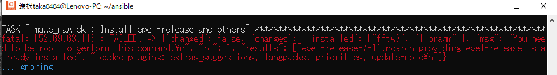

# AWSフルコース講座 第13回課題

## 実施内容


### 実施結果

### 所感

## 備忘録

<details>
<summary>作業工程</summary>
</details>

- Ansibleのインストール (Ubuntu 22.04 LTS)
  - インストール準備とインストール
    ```
    sudo apt-get update
    ```
      
    ```
    sudo apt-get install software-properties-common
    ```
      
    ```
    sudo apt-add-repository --yes --update ppa:ansible/ansible
    ```
      
    ```
    sudo apt-get install ansible
    ```
      
    ```
    ansible --version
    ```
      
- Ansibleによる環境構築準備  
  - 階層構造  
      
  
  - Playbookの作成 `site.yml`  
      
  
  - Role
    - yum update (`sudo yum update`に相当)  
        
    - Rolesの階層は以下コマンドで作成可(ansible ディレクトリで実行)
      ```
      ansible-galaxy init roles/<Rile名>
      ```
        
  
  - Inventoryの作成
    - ターゲットノード(EC2)のIPアドレスとユーザー名を定義⇒ドライランでエラー発生  
        
    - ポート番号を追加で定義⇒ドライランでエラー発生  
        
    - SSH接続用のpemキーのパスを追加⇒OK  
        
  
  - Ansible.cfgの作成
    - Inventoryファイルのパスを追加し、`ansible-playbook`コマンド時の追記を省略  
        
    - EC2初回SSH接続時のfingerprintダイアログを発生させないため、`host_key_checking=False`の設定を追加  
        

- Playbookの作成(Role別)
  - MySQL
    - MySQLのRepositoryをEC2に追加する際、コマンドライン手入力で使っていたURLではエラー出力（コマンドライン入力時は成功）
    - EC2に直接追加せず、EC2の一時ファイル保管ディレクトリに一度ダウンロードを試行しても、403エラー出力（ブラウザにURL直接入力時は成功）
    - curlコマンドでURLを確認するとリダイレクトされている事が判明（ステータスコード302）  
      
        
    - リダイレクト先のURLに変更で成功  
        
    - Mysql-community-serverパッケージは、実際にMySQLのRepositoryをダウンロードしないと実行できず、ドライランではエラーとなるため、`ignore_errors`設定を追加(動作確認後に削除)  
        
  
  - git  
      
  
  - anyenv  
    - 個別のroleフォルダの内容を一括作成  
        
    - `shell`モジュールや`command`モジュールは以下設定を追加
      - 実行するとchangedが返されるので、`changed_when: no`を設定
      - 冪等性の理由から再実行されないよう条件を追加  
          
      - ansibleの初回実行時は`anyenv -v`コマンドは失敗するが、以降は成功するので、失敗時のみ各処理を実行させる  
          
    - `anyenv install -init`コマンド実行時に`y/N`回答ダイアログが出るので、`yes`コマンドで対応  
        
        
    - `anyenv install rbenv`コマンドはフルパス指定にしないとコマンドが認識されない  
        
    - `rbenv install 3.2.3`コマンドは`install`コマンドが認識されない(PATH変数追加でもNG)ため、環境設定をロードするコマンドと合わせて実行
      - フルパス記述していない場合は`command not found`のメッセージ  
          
      - フルパス記述しても、`no such command 'install'`のメッセージ  
          
          
      - `rbenv install`コマンドの前に環境設定を読み込ませるコマンドを追加することで成功  
          

  - rails & bundler & yarn
    - Bundlerはデフォルト状態のバージョンが異なるので`gem update --system`コマンドで指定バージョンに変更  
        
    - Railsはインストール時にdocumentが無い旨のエラーが出るので、`--no-document`オプションを追加  
        
        
    - Yarnはインストール後、`nodenv rehash`コマンド実行により`yarn`コマンドが使えるようになるので、これをPATH変数に追加  
        
        
        

  - ImageMagick
    - epelのインストール時に'y/N'ダイアログが出るので、'yes'コマンドで対応  
        
    - 'epel-release'等のパッケージインストールはrootユーザー必須  
        
    - 'remi-release-7'および'ImageMagick7'のインストール時は`sudo`コマンド必須
        

  - raisetech-live8-sample-app
    - 課題5で作成したサンプルアプリを作動させたEC2インスタンスのファイルをテンプレート（拡張子j2）に使用  
      - EC2インスタンスからローカルにコピー
        ```
        scp -i (使用するpemキー、パス含む) ec2-user@XXX.XXX.XXX.XXX:/home/ec2-user/(コピー元ファイル)  /home/AAAA/(転送先ディレクトリ)
        ```
          
        
        
          
    - `/config/database.yml`は変更箇所/内容が多いのでテンプレートとして使用  
      - templateモジュール使用時に`remote_src`オプションを追加するよう書かれたエラーが表示されたので追加  
        
        
    - `bin/setup`コマンドの実行が途中で止まってしまう
      - `timeout`設定をしておかないとansibleの実行が自動で止まらない  
          
      - 途中で進まなくなったインスタンスを手動でコマンド実行すると、特定のgemパッケージのインストールが終わっていない
          
          
          
      - コマンド実行時に追加インストールされているgemパッケージ  
          
      - 途中でインストールが止まってしまうgemパッケージを個別インストールしたうえで`bin/setup`コマンドを実行することで解決  
          
    - `yarn`のインストールコマンドも実行したが、試しに手作業で`bin/dev`実行するとエラー  
      
      - `raisetech-live8-sample-app`ディレクトリ上で`yarn`のインストールコマンド実行  
        
    - 以上までのインストールが完了したアプリで`bin/dev`コマンドを実行すると、正常に作動
      

  - systemd
    - `puma.service.sample`を`/etc/systemd/system/puma.service`としてコピー  
    - systemdがインスタンス起動時に自動起動されるよう設定(今時点では起動不要なのでstoppedに設定)  
        
    - 上記だけだとSystemd起動エラー発生  
        
        
      
      - ChatGPTによる検討もしたが結局手詰まり  
          
          
        
      - `bin/dev`コマンドを一度実行するとエラー発生しなくなることが判明  
          
        
      - `bin/dev`コマンド内で呼び出しているgemパッケージをインストールしても変化なし  
        
      - 試行錯誤の結果、`bin/dev`コマンドを一度実行するとエラーは解消するが、正常処理の範囲内では実行を止められないので、タイムアウトさせて終了させるるが、サンプルアプリケーションが起動したままになってしまうので、インスタンスを再起動  
          
        

  - Nginx
    - `/etc/nginx/conf.d/app.conf`はファイル自体無いので課題5で作成したものをテンプレートして使用  
        
    - テンプレートファイルから`app.conf`作成にはroot権限を要求されるので追加  
        
        
    - `nginx.conf`の実行ユーザーを`replace`モジュールで変更  
    - Nginxがインスタンス起動時に自動起動されるよう設定(今時点では起動不要なのでstoppedに設定)  
        

  - S3 storage  
    - `/config/environments/development.rb`の一部内容を書き換え  
        
      - 以下はロードバランサ経由でアクセスした際のエラー防止策であり画像保存先をS3に変更する目的ではないが、併せて設定しておく  
          
    - `config/storage/yml`の一部内容を書き換え  
      
      - ansible.builtin.replaceモジュールで文字列置換に予期せぬエラー発生  
          
      - 変換対象の文字列から`['を除外すると成功  
          
          
  
  - 全体テスト  
    - `yum`の最新化で当初は出なかったエラーが発生    
        
      - chatGPTにソースコードとエラーコードを分析させて対策追加    
          
          

- CircleCIへのAnsible実装


- Severspec

        
        
        
        
        


> [!NOTE]  
> サンプル

> [!TIP]  
> サンプル

> [!IMPORTANT]  
> サンプル

> [!WARNING]  
> サンプル

> [!CAUTION]  
> サンプル

 
