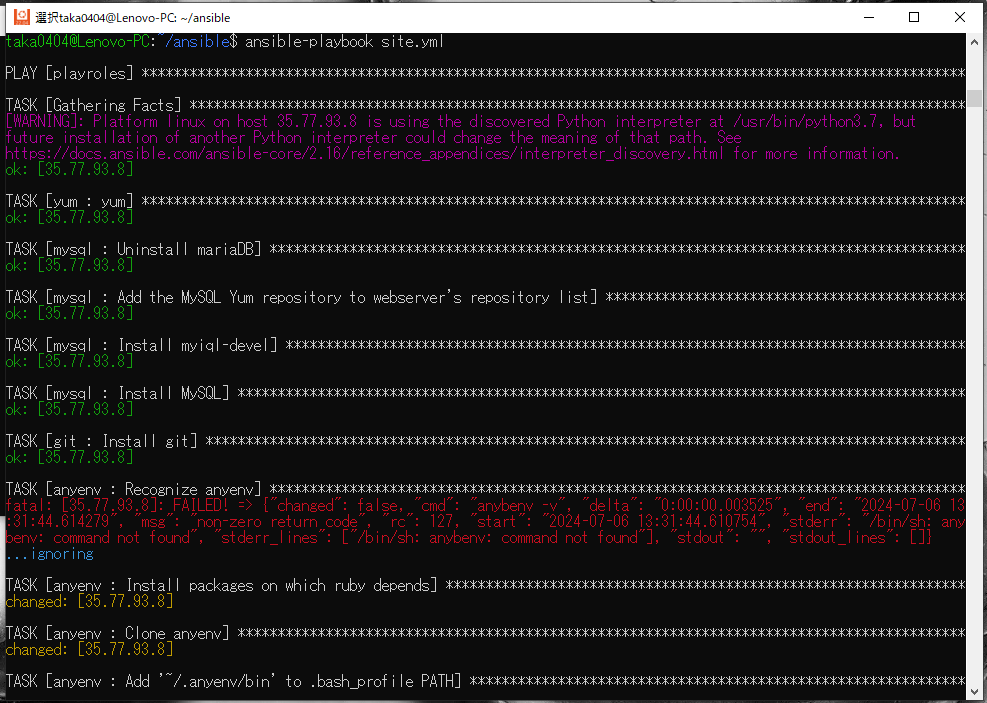
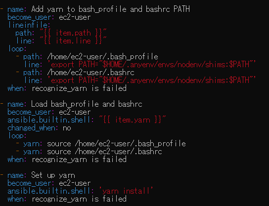
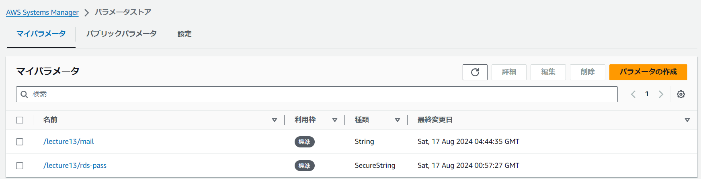
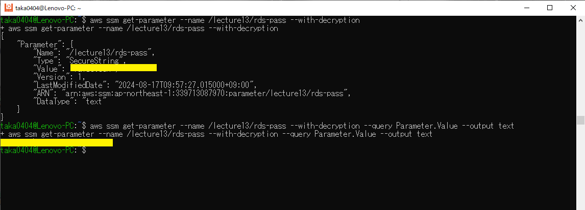
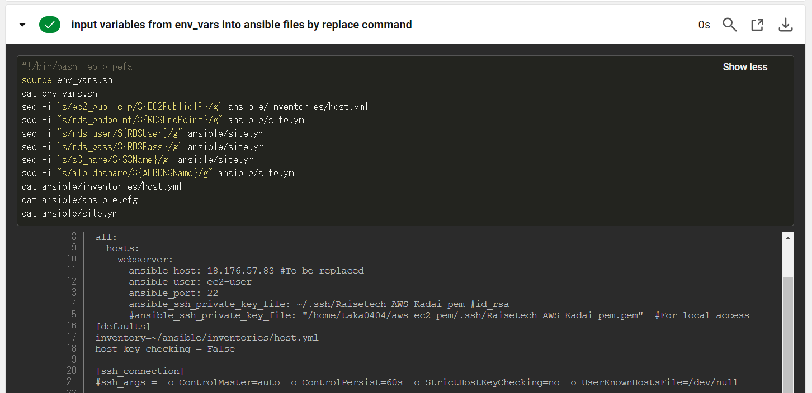
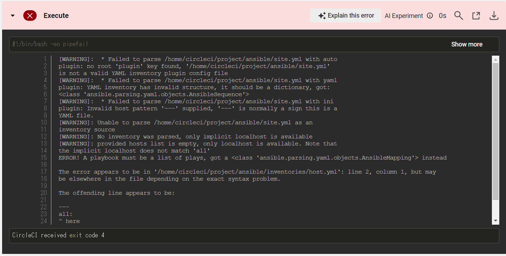

# AWSフルコース講座 第13回課題

## 実施内容


### 実施結果

### 所感

## 備忘録

<details>
<summary>作業工程</summary>
</details>

- Ansibleのインストール (Ubuntu 22.04 LTS)
  - インストール準備とインストール
    ```
    sudo apt-get update
    ```
      
    ```
    sudo apt-get install software-properties-common
    ```
      
    ```
    sudo apt-add-repository --yes --update ppa:ansible/ansible
    ```
      
    ```
    sudo apt-get install ansible
    ```
      
    ```
    ansible --version
    ```
      
- Ansibleによる環境構築準備  
  - 階層構造  
      
  
  - Playbookの作成 `site.yml`  
      
  
  - Role
    - yum update (`sudo yum update`に相当)  
        
    - Rolesの階層は以下コマンドで作成可(ansible ディレクトリで実行)
      ```
      ansible-galaxy init roles/<Rile名>
      ```
        
  
  - Inventoryの作成
    - ターゲットノード(EC2)のIPアドレスとユーザー名を定義⇒ドライランでエラー発生  
        
    - ポート番号を追加で定義⇒ドライランでエラー発生  
        
    - SSH接続用のpemキーのパスを追加⇒OK  
        
  
  - Ansible.cfgの作成
    - Inventoryファイルのパスを追加し、`ansible-playbook`コマンド時の追記を省略  
        
    - EC2初回SSH接続時のfingerprintダイアログを発生させないため、`host_key_checking=False`の設定を追加  
        

- Playbookの作成(Role別)
  - MySQL
    - MySQLのRepositoryをEC2に追加する際、コマンドライン手入力で使っていたURLではエラー出力（コマンドライン入力時は成功）
    - EC2に直接追加せず、EC2の一時ファイル保管ディレクトリに一度ダウンロードを試行しても、403エラー出力（ブラウザにURL直接入力時は成功）
    - curlコマンドでURLを確認するとリダイレクトされている事が判明（ステータスコード302）  
      
        
    - リダイレクト先のURLに変更で成功  
        
    - Mysql-community-serverパッケージは、実際にMySQLのRepositoryをダウンロードしないと実行できず、ドライランではエラーとなるため、`ignore_errors`設定を追加(動作確認後に削除)  
        
  
  - git  
      
  
  - anyenv  
    - 個別のroleフォルダの内容を一括作成  
        
    - `shell`モジュールや`command`モジュールは以下設定を追加
      - 実行するとchangedが返されるので、`changed_when: no`を設定
      - 冪等性の理由から再実行されないよう条件を追加  
          
      - ansibleの初回実行時は`anyenv -v`コマンドは失敗するが、以降は成功するので、失敗時のみ各処理を実行させる  
          
    - `anyenv install -init`コマンド実行時に`y/N`回答ダイアログが出るので、`yes`コマンドで対応  
        
        
    - `anyenv install rbenv`コマンドはフルパス指定にしないとコマンドが認識されない  
        
    - `rbenv install 3.2.3`コマンドは`install`コマンドが認識されない(PATH変数追加でもNG)ため、環境設定をロードするコマンドと合わせて実行
      - フルパス記述していない場合は`command not found`のメッセージ  
          
      - フルパス記述しても、`no such command 'install'`のメッセージ  
          
          
      - `rbenv install`コマンドの前に環境設定を読み込ませるコマンドを追加することで成功  
          

  - rails & bundler & yarn
    - Bundlerはデフォルト状態のバージョンが異なるので`gem update --system`コマンドで指定バージョンに変更  
        
    - Railsはインストール時にdocumentが無い旨のエラーが出るので、`--no-document`オプションを追加  
        
        
    - Yarnはインストール後、`nodenv rehash`コマンド実行により`yarn`コマンドが使えるようになるので、これをPATH変数に追加  
        
        
        

  - ImageMagick
    - epelのインストール時に'y/N'ダイアログが出るので、'yes'コマンドで対応  
        
    - 'epel-release'等のパッケージインストールはrootユーザー必須  
        
    - 'remi-release-7'および'ImageMagick7'のインストール時は`sudo`コマンド必須
        

  - raisetech-live8-sample-app
    - 課題5で作成したサンプルアプリを作動させたEC2インスタンスのファイルをテンプレート（拡張子j2）に使用  
      - EC2インスタンスからローカルにコピー
        ```
        scp -i (使用するpemキー、パス含む) ec2-user@XXX.XXX.XXX.XXX:/home/ec2-user/(コピー元ファイル)  /home/AAAA/(転送先ディレクトリ)
        ```
          
        
        
          
    - `/config/database.yml`は変更箇所/内容が多いのでテンプレートとして使用  
      - templateモジュール使用時に`remote_src`オプションを追加するよう書かれたエラーが表示されたので追加  
        
        
    - `bin/setup`コマンドの実行が途中で止まってしまう
      - `timeout`設定をしておかないとansibleの実行が自動で止まらない  
          
      - 途中で進まなくなったインスタンスを手動でコマンド実行すると、特定のgemパッケージのインストールが終わっていない
          
          
          
      - コマンド実行時に追加インストールされているgemパッケージ  
          
      - 途中でインストールが止まってしまうgemパッケージを個別インストールしたうえで`bin/setup`コマンドを実行することで解決  
          
    - `yarn`のインストールコマンドも実行したが、試しに手作業で`bin/dev`実行するとエラー  
      
      - `raisetech-live8-sample-app`ディレクトリ上で`yarn`のインストールコマンド実行  
        
    - 以上までのインストールが完了したアプリで`bin/dev`コマンドを実行すると、正常に作動
      

  - systemd
    - `puma.service.sample`を`/etc/systemd/system/puma.service`としてコピー  
    - systemdがインスタンス起動時に自動起動されるよう設定(今時点では起動不要なのでstoppedに設定)  
        
    - 上記だけだとSystemd起動エラー発生  
        
        
      
      - ChatGPTによる検討もしたが結局手詰まり  
          
          
        
      - `bin/dev`コマンドを一度実行するとエラー発生しなくなることが判明  
          
        
      - `bin/dev`コマンド内で呼び出しているgemパッケージをインストールしても変化なし  
        
      - 試行錯誤の結果、`bin/dev`コマンドを一度実行するとエラーは解消するが、正常処理の範囲内では実行を止められないので、タイムアウトさせて終了させるが、サンプルアプリケーションが起動したままになってしまうので、インスタンスを再起動  
          
        

  - Nginx
    - `/etc/nginx/conf.d/app.conf`はファイル自体無いので課題5で作成したものをテンプレートして使用  
        
    - テンプレートファイルから`app.conf`作成にはroot権限を要求されるので追加  
        
        
    - `nginx.conf`の実行ユーザーを`replace`モジュールで変更  
    - Nginxがインスタンス起動時に自動起動されるよう設定(今時点では起動不要なのでstoppedに設定)  
        

  - S3 storage  
    - `/config/environments/development.rb`の一部内容を書き換え  
        
      - 以下はロードバランサ経由でアクセスした際のエラー防止策であり画像保存先をS3に変更する目的ではないが、併せて設定しておく  
          
    - `config/storage/yml`の一部内容を書き換え  
      
      - ansible.builtin.replaceモジュールで文字列置換に予期せぬエラー発生  
          
      - 変換対象の文字列から`['を除外すると成功  
          
          

  - 全体テスト  
    - `yum`の最新化で当初は出なかったエラーが発生  
        
      - chatGPTにソースコードとエラーコードを分析させて対策追加  
          
          

- CircleCIへのCloudformation実装
  - CircleCI
    - CircleCIの適用先となるGitHubリポジトリを新規作成  
        
    - ローカルにクローンし、`.gitignore`作成およびテンプレートファイル保管してmainブランチにpush  
        
        
        
        
    - CircleCI上で新規ブランチに`say-hello-workflow`を作成し、リネーム後にローカルへ`git fetch`  
        
        
        
        
        
  - Cloudformation  
    - CloudformationおよびAWS CLIのorbsを`config.yml`に追加  
        
    - 権限不足でエラーが出るので専用のIAMユーザーを作成し権限を追加＆CircleCIの環境変数にアクセスキーとリージョン情報を登録  
        
        
        
        
        
        
        
        
        
    - CircleCI未承認のorbsを使うには設定変更が必要  
        
        
        
    - CloudFormationのへのアクセス権限も必要  
        
        
        
    - IAMの設定変更\(今回はロールの作成\)を行っているテンプレートファイルには追加の設定項目`CAPABILITY_NAMED_IAM`が必要  
        
        
    - 参考：CircleCIのエラーメッセージの詳細説明機能もエラー確認に有益  
        
    - Systems Managerにテンプレートファイルへのハードコーディングを避けたい情報を登録  
      - EC2向けセキュリティグループのマイIPアドレス  
      - SNS向けメールアドレス
      - RDS向けパスワード(SecureString対応)
        - 補足：今回はパスワードローテーションを使用しない、使用料無料の理由から、Secrets ManagerではなくSystems Managerを使用  
          
    - [第12回課題](lecture12.md)で使用したcfn-lintによるセキュリティチェックもパスしていることを確認  
        
    - IAMの権限設定\(最終的な状態\)  
        

- AWS CLIによるCloudFormationで構築したリソースからAnsibleへの各種変数の引継ぎ  
  - AWS CLI
    - ローカルからAWS各リソースにアクセスできるようアクセス権を設定  
      ```
      aws configure
      ```
      
  - 変数取得
    - ローカルからCLIを使ってCloudformationで構築したリソースから以下情報を取得するのに必要なコマンドを検討
      - EC2 Public IP Address
      - RDS Master User Name
      - RDS Master Usr Password
      - RDS Endpoint
      - ALB DNS Name
      - S3 Bucket Name
  - Cloudformation
    - スタック情報にEC2のPublic IPは表示されない  
        
    - スタック情報にRDSのEndpoint・Userは表示されない\(PassはSystems Managerから取得する\)  
        
    - スタック情報にALBのDNS Nameは表示されない  
        
    - スタック情報にS3のBucketNameは表示あり  
        
  - EC2
    - Public IPを取得  
        
  - RDS
    - Endpoint・Userを取得  
      
        
  - ALB
    - DNS Nameを取得  
        
  - Systems Manager
    - Passを取得  
        
  - 各変数をシェルスクリプトへ出力
    ```
    echo expourt 変数名=$(変数取得コマンド) >> シェルスクリプトファイル名
    ```

- CircleCIへのAnsible実装
  - Ansible
    - orbs追加  
        
    - ローカルで作成し動作確認済みのansible各種ファイルをコピー  
        
  - 変数引継ぎ
    - ジョブ内の別ステップ間で、`persist_to_workspace`で保存した変数を`attach_workspace`で引継ぎ  
        
    - `env_vars.sh`に保管した変数を`ansible/inventories/host.yml`および`ansible/site.yml`に置換コマンドで反映  
        
  - Fingerprintの登録  
      
      
    - フィンガープリントを直接貼らずに環境変数にしてみたが、CircleCIのansibleフィンガープリントを読み取らないため直接入力に変更  
        
        
  - インベントリーファイルの読み込みエラー
    - インベントリーファイルの指示なし  
        
    - オプション設定を`inventory-parameters`で指定したがインベントリーファイルを読み取れないエラー  
        
    - `playbook-options`でIPアドレスを引数にしたところ、結果PASSだがインベントリーファイル読み取れず  
        
  - インスタンス接続エラー  
    - `playbook-options`でインベントリーファイルを引数にしたところ接続エラー  
        
    - SSH接続についてセキュリティグループのインバウンドグループ設定を見直し  
        
  - インスタンス接続のタイムアウトエラー
    - 確認メッセージが出てしまいタイムアウト  
        
    - `ansible.cfg`が読み込まれていない  
        
    - `ansible.cfg`をルートディレクトリに動かしたところ読み取られるようになった  
        
        
        
  - Ansible実行時エラー（ローカル実行時は発生しなかった）  
    - 意図しない整数値コマンドでエラー⇒`timeout`の設定が怪しい  
        
        
    - `timeout`設定をコロンで囲むと、'ansible.builtin.shell'モジュールとコンフリクトしていると指摘  
        
    - `timeout`設定をコマンド内に変更  
        
  - Ansible内の変数代入エラー
    - `ansible/site.yml`で定義した変数が代入できていない  
        
        
    - `ansible/site.yml`にCloudformationから変数引継ぎ後を再確認⇒Ansible内の変数の一部を誤って置換していた  
        
    - Cloudformationからの引継ぐ変数の名称を変更  
        
        
    - Ansible実行完了  
        
        
  - サンプルアプリ動作確認エラー
    - ALBのDNS名でアクセスしようとすると502エラー発生⇒サーバー確認するとNginxが作動していない  
        
    - サーバー名の長さは64以下にするか、上限値を増やす必要あり  
        
    - `/etc/nginx/nginx.conf`に設定項目を追加  
        
    - サンプルアプリの正常動作を確認  
        

- CircleCIへのSeverspec実装
  - Serverspecのorbs追加  
      
      
    -
    - a
        
        
      
    - 詳細


> [!NOTE]  
> サンプル

> [!TIP]  
> サンプル

> [!IMPORTANT]  
> サンプル

> [!WARNING]  
> サンプル

> [!CAUTION]  
> サンプル

 
